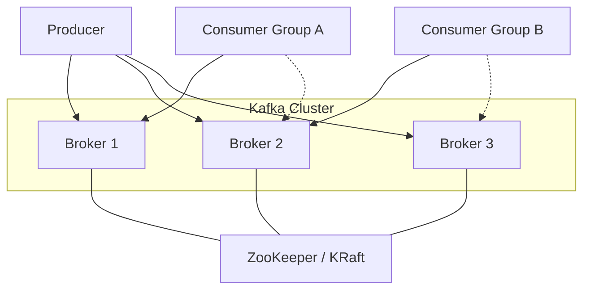

# Kafka 架构深度解析

> 上文 [MQ 高并发问题解决方案](/fw/mq/high-concurrency) 提到的 Kafka 事务消息、幂等发送，背后是一套怎样的架构在支撑？

## 核心角色

Kafka 的架构围绕四个核心角色展开：

| 角色 | 职责 |
|------|------|
| Producer | 消息生产者，负责将消息发送到 Topic |
| Broker | 消息代理，存储和管理消息 |
| Consumer | 消息消费者，从 Topic 拉取消息 |
| ZooKeeper | 元数据管理（KRaft 模式已移除依赖） |



## Topic 与 Partition

Topic 是消息的逻辑分类，Partition 是物理存储单元。

```java
// 创建 Topic：3 个分区，2 个副本
bin/kafka-topics.sh --create --topic order-events \
    --partitions 3 \
    --replication-factor 2 \
    --bootstrap-server localhost:9092
```

### Partition 的意义

1. **并行消费**：一个 Topic 可以被多个 Consumer 并行消费
2. **水平扩展**：Partition 分布在不同 Broker 上
3. **顺序保证**：单 Partition 内消息有序

### Partition 分布

假设 3 个 Broker，3 个 Partition：

```
Broker-1: [Partition-0 (Leader), Partition-2 (Follower)]
Broker-2: [Partition-1 (Leader), Partition-0 (Follower)]
Broker-3: [Partition-2 (Leader), Partition-1 (Follower)]
```

每个 Partition 的 Leader 负责读写，Follower 负责同步。

## Producer 发送流程

```java
// Producer 核心配置
Properties props = new Properties();
props.put("bootstrap.servers", "kafka:9092");
props.put("key.serializer", "org.apache.kafka.common.serialization.StringSerializer");
props.put("value.serializer", "org.apache.kafka.common.serialization.StringSerializer");
props.put("acks", "all");        // 等待所有副本确认
props.put("retries", 3);        // 重试次数

KafkaProducer<String, String> producer = new KafkaProducer<>(props);

// 发送消息
producer.send(new ProducerRecord<>("topic", "key", "value"), (metadata, exception) -> {
    if (exception == null) {
        System.out.println("发送成功，partition=" + metadata.partition()
            + ", offset=" + metadata.offset());
    }
});
```

发送流程：
1. Producer 根据 key 路由到对应 Partition
2. 消息进入 RecordAccumulator 缓冲区
3. Sender 线程批量发送到 Broker
4. 等待 acks 确认

## Consumer 消费流程

```java
// Consumer 核心配置
Properties props = new Properties();
props.put("bootstrap.servers", "kafka:9092");
props.put("group.id", "order-consumer-group");
props.put("auto.offset.reset", "earliest");
props.put("enable.auto.commit", false);

KafkaConsumer<String, String> consumer = new KafkaConsumer<>(props);
consumer.subscribe(Arrays.asList("topic"));

while (true) {
    ConsumerRecords<String, String> records = consumer.poll(Duration.ofMillis(100));
    for (ConsumerRecord<String, String> record : records) {
        process(record);
    }
    consumer.commitSync();  // 手动提交 offset
}
```

## 高可用机制

Kafka 的高可用靠的是 **多副本 + ISR**：

```properties
# Replication 配置
replication.factor=3
min.insync.replicas=2
```

- **ISR (In-Sync Replicas)**：与 Leader 保持同步的 Follower 集合
- **Leader 宕机**：从 ISR 中选举新的 Leader
- **消息不丢失**：`acks=all` + `min.insync.replicas=2`

---

*分区是 Kafka 并发的基础，下一节深入 [Kafka 分区与消费者组](/fw/mq/kafka/partition)*
