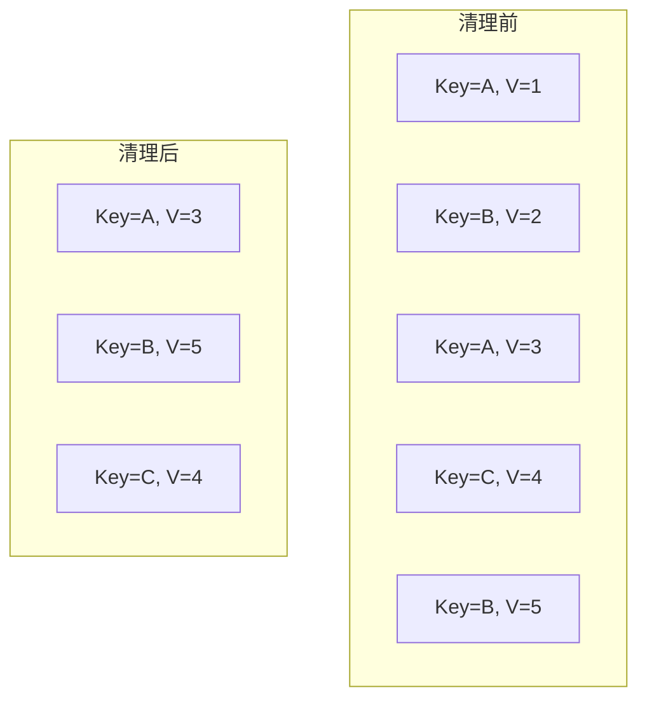
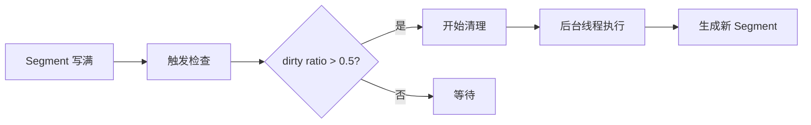

# Kafka 日志压缩与清理策略

> [Kafka Rebalance 机制](/fw/mq/kafka/rebalance) 提到消息会被消费，那历史消息是如何清理的？

## 两种清理策略

| 策略 | 适用场景 | 行为 |
|------|----------|------|
| delete | 日志、事件流 | 按时间/大小删除旧消息 |
| compact | 状态变更、配置更新 | 保留每个 key 的最新值 |

## Delete 策略（默认）

### 按时间保留

```properties
# 保留 7 天
log.retention.hours=168

# 保留 30 天
log.retention.hours=720
```

### 按大小保留

```properties
# 保留最近 100GB
log.retention.bytes=107374182400
```

### 按 Segment 维度

```properties
# 删除超过保留时间的 Segment 文件
log.retention.check.interval.ms=300000
```

## Compact 策略

消息的 key 相同，只保留最新的 value：



### 适用场景

- **配置中心**：同一 key 的最新配置
- **用户画像**：用户属性的最新快照
- **Binlog**：变更记录，只需要最新状态

### 配置示例

```properties
# 启用日志压缩
cleanup.policy=compact

# Segment 头部的最小消息数（避免频繁压缩）
min.cleanable.dirty.ratio=0.5

# 压缩的间隔
log.cleaner.io.buffer.size=134217728
```

## 清理机制详解

### Log Cleaner 线程

```java
// LogCleaner 核心逻辑
public void clean(Log segment) {
    Map<String, ByteBuffer> latestValues = new HashMap<>();

    for (Message msg : segment) {
        String key = msg.getKey();
        // 记录每个 key 的最新值
        latestValues.put(key, msg.getValue());
    }

    // 写入新的 Segment，保留最新值
    writeCompactedSegment(latestValues);
}
```

### 清理时机



## 监控清理进度

```bash
# 查看 Cleaner 状态
bin/kafka-log-dirs.sh --describe --bootstrap-server localhost:9092

# 输出示例
{
  "partitions": [{
    "topic": "config-topic",
    "partition": 0,
    "offset": 1000000,
    "leaderEpoch": 1,
    "size": 10737418240,
    "lag": 5000000,
    "cleaningPercentage": 45
  }]
}
```

## 配置建议

| 场景 | 保留策略 | 推荐配置 |
|------|----------|----------|
| 日志采集 | 按时间 | `retention.hours=168` |
| 事件流 | 按大小 | `retention.bytes=1TB` |
| 配置变更 | Compact | `cleanup.policy=compact` |
| 状态同步 | Compact | `cleanup.policy=compact` |

---

*消息保留策略决定存储容量：[Kafka Offset 管理](/fw/mq/kafka/offset) 讲解消费进度管理*
