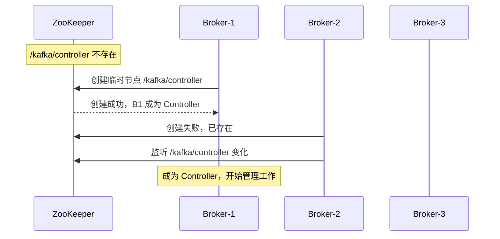
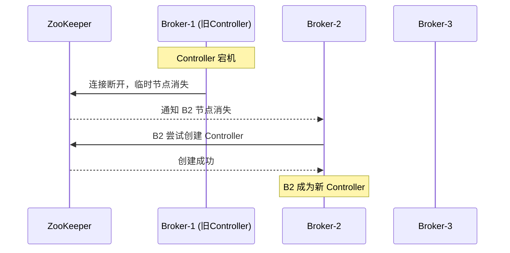

# Kafka 控制器选举

> 上一节 [Kafka 索引机制与零拷贝](/fw/mq/kafka/kafka-index) 提到 Broker 之间需要协调，Controller 就是负责协调的核心组件。

## Controller 是什么

Controller 是 Kafka 集群中的一个特殊 Broker，负责管理整个集群的元数据：

| 职责 | 说明 |
|------|------|
| Leader 选举 | Partition Leader 宕机时，选举新的 Leader |
| 分区重分配 | 扩缩容时管理 Partition 副本 |
| Broker 上线/下线 | 感知 Broker 状态变化 |
| Topic 管理 | 创建/删除 Topic |

## 选举机制

Kafka 使用 **ZooKeeper 临时节点** 实现 Controller 选举：

```bash
# ZooKeeper 中的 Controller 节点
ls /kafka/controller
# 返回 broker.id

# 监听 Controller 变化
stat /kafka/controller true true
```

### 选举流程



### Controller 宕机



## Controller 职责详解

### 1. Partition Leader 选举

当 Partition Leader 宕机时，Controller 从 ISR 中选举新 Leader：

```java
// 选举策略：优先从 ISR 中选择
// 如果 ISR 为空，询问所有 Follower
// 都不行则 leader is null，无法服务

List<Integer> inSyncReplicas = partition.isr;
if (inSyncReplicas.isEmpty()) {
    // 无法选举，服务不可用
    return Optional.empty();
}

// 按 AR 顺序选择第一个在 ISR 中的
return Optional.of(inSyncReplicas.get(0));
```

### 2. 监听 Broker 变化

```java
// Broker 上线
controller.onBrokerUp(brokerId) {
    // 分配副本
    // 启动副本同步
}

// Broker 下线
controller.onBrokerDown(brokerId) {
    // 副本从 AR 中移除
    // 处理 Leader 不在 ISR 的 Partition
}
```

### 3. 分区副本分配

```bash
# 创建 Topic 时，Controller 负责分配副本
bin/kafka-topics.sh --create --topic my-topic \
    --partitions 6 \
    --replication-factor 3

# Controller 分配策略：尽量均匀分布在不同 Broker
# Broker-1: [P0, P3]
# Broker-2: [P1, P4]
# Broker-3: [P2, P5]
```

## KRaft 模式（Kafka 3.0+）

Kafka 2.8+ 引入了 KRaft 模式，移除对 ZooKeeper 的依赖：

```properties
# KRaft 模式配置
process.roles=broker,controller
node.id=1
controller.quorum.voters=1@localhost:9093
```

**优势**：
- 部署简化，不再需要 ZooKeeper
- 元数据管理更高效
- 启动更快

**劣势**：
- 早期版本稳定性待验证
- 生产环境建议 Kafka 3.3+ 再使用

---

*Controller 管理分区，[Kafka Rebalance 机制](/fw/mq/kafka/rebalance) 是消费者层面的协调*
