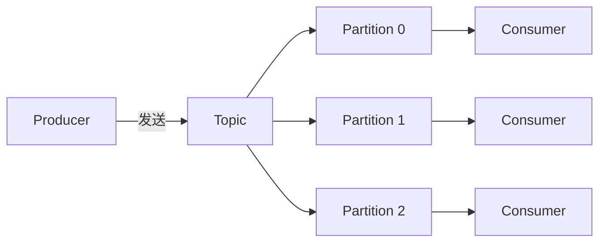

# Kafka

> LinkedIn 开源的高吞吐分布式发布-订阅消息系统，大数据实时计算、日志采集、事件流处理的事实标准。

## 核心定位

Kafka 不是传统意义上的消息队列，而是一个**分布式事件流平台**。它把消息持久化到磁盘，按顺序写入而不是随机寻道，单机能轻松跑到 50万 msg/s 以上的写入吞吐。这一特性让 Kafka 在日志采集、用户行为埋点、大数据 ETL、实时风控等场景里几乎成为唯一选择。

## 学习路径

按"架构 → 并发 → 可靠性 → 顺序 → 丢失 → 存储 → 索引 → 高可用"的递进顺序展开，前一节是后一节的基础：

### 基础架构

| 文章 | 重点 | 何时阅读 |
|------|------|----------|
| [架构深度解析](/fw/mq/kafka/architecture) | Broker / Topic / Partition / Producer / Consumer | 第一次接触 Kafka |
| [分区与消费者组](/fw/mq/kafka/partition) | 分区分配策略、消费者组模式 | 了解并行消费的底层 |
| [Offset 管理](/fw/mq/kafka/offset) | 消费进度提交、自动 vs 手动 | 排查消息丢失或重复 |

### 可靠性与顺序

| 文章 | 重点 | 何时阅读 |
|------|------|----------|
| [消息可靠性保证](/fw/mq/kafka/reliability) | acks / ISR / 多副本 | 数据不能丢的业务 |
| [顺序消息实现](/fw/mq/kafka/ordering) | 单分区顺序、幂等、分区键 | 订单状态流转场景 |
| [消息丢失与重复消费](/fw/mq/kafka/message-loss) | 丢失场景与重复消费方案 | 排查线上数据不一致 |

### 存储与性能

| 文章 | 重点 | 何时阅读 |
|------|------|----------|
| [存储机制与日志分段](/fw/mq/kafka/storage) | 顺序写、Segment、PageCache | 想理解 Kafka 为什么快 |
| [索引机制与零拷贝](/fw/mq/kafka/kafka-index) | mmap、sendfile、稀疏索引 | 面试高频追问点 |

### 高可用与运维

| 文章 | 重点 | 何时阅读 |
|------|------|----------|
| [控制器选举](/fw/mq/kafka/controller) | Controller、Leader 选举、KRaft | 理解 Broker 协调 |
| [Rebalance 机制](/fw/mq/kafka/rebalance) | 触发条件、StickyAssignor | 排查消费暂停/延迟 |
| [日志压缩与清理策略](/fw/mq/kafka/cleanup) | log.cleanup.policy、压缩保留 | 磁盘空间规划 |

## 常见疑问

**Kafka 适合什么场景？**
日志采集（ELK 链路）、用户行为埋点、大数据实时计算（Flink / Spark Streaming）、事件溯源（Event Sourcing）、变更数据捕获（CDC）。

**Kafka 不适合什么场景？**
严格的事务消息（RocketMQ 更强）、复杂的消息路由（RabbitMQ 更灵活）、单条消息的低延迟（RabbitMQ μs 级 vs Kafka ms 级）。

**Kafka 集群最少几台 Broker？**
生产环境推荐 3 台起步，配合 `replication.factor=3` + `min.insync.replicas=2`，能在 1 台宕机时继续服务。

---

*下一步深入 [RocketMQ](/fw/mq/rocketmq) 了解事务消息与顺序消息的另一种实现思路*