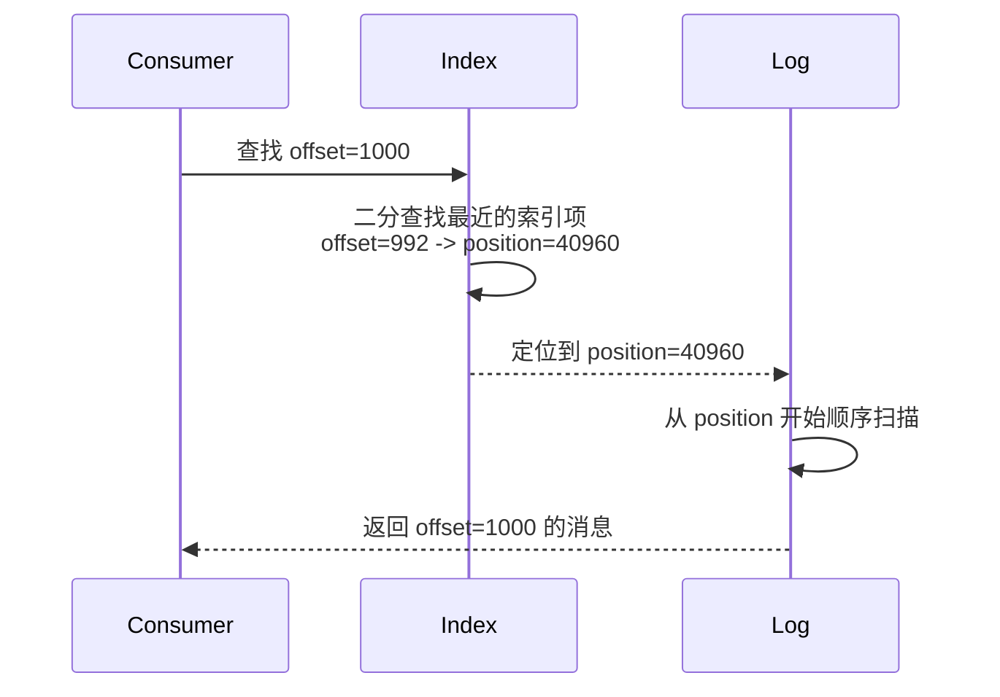
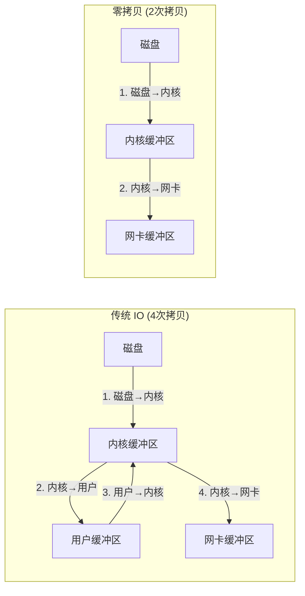
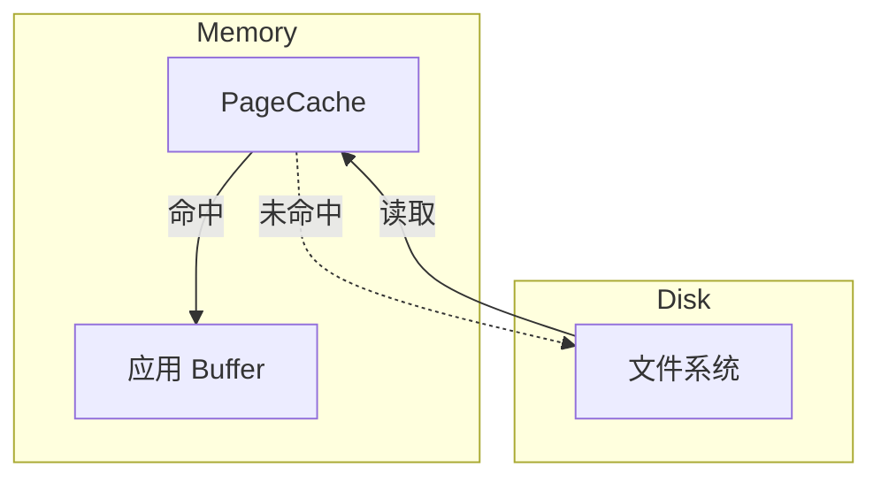

# Kafka 索引机制与零拷贝

> 上一节 [Kafka 存储机制与日志分段](/fw/mq/kafka/storage) 提到了 `.index` 文件，这节深入解析索引和零拷贝。

## 稀疏索引

Kafka 使用稀疏索引，不是每条消息都建索引：

```properties
# 索引条目间隔（默认 4096 条消息一个索引项）
index.interval.bytes=4096
```

### 索引查找流程

假设要读取 offset=1000 的消息：



**稀疏索引的优势**：空间小，查找快。

## 零拷贝技术

传统数据读取 vs 零拷贝：



### mmap（内存映射）

```java
// Linux: 将文件映射到内存
FileChannel.map(FileChannel.MapMode.READ_WRITE, 0, fileSize);

// 读取时：内存直接访问，避免 read/write 系统调用
// 写入时：直接写内存，由 OS 刷盘
```

### sendfile

```java
// 内核空间直接转发，避免用户态拷贝
FileChannel.transferTo(position, length, socketChannel);
```

Kafka 消费者获取消息时，走的是 `sendfile` 路径：

```bash
# 查看 Kafka 使用的 IO 方式
strace -e trace=sendfile -p <kafka_pid>
```

## PageCache 加速

Linux 的 PageCache 会缓存热点数据：



**写入**：先写 PageCache，异步刷盘
**读取**：热点数据在内存，直接返回

## 面试高频追问

**Q：为什么 Kafka 比传统数据库快？**

A：从 IO 路径看，传统数据库：
1. 写操作要刷 redo log（顺序写）
2. 写操作要更新索引（随机写）
3. 数据和索引都在磁盘

Kafka：
1. 只有顺序写
2. 没有索引更新
3. 利用 PageCache 热点缓存
4. 零拷贝减少 CPU 开销

**Q：Kafka 的缺点是什么？**

A：
1. 消息堆积会占用大量磁盘
2. 过期消息清理有 IO 开销
3. Topic 数量过多时元数据压力大

---

*存储与索引是性能基石，下一节看 Broker 层面如何协调：[Kafka 控制器选举](/fw/mq/kafka/controller)*
