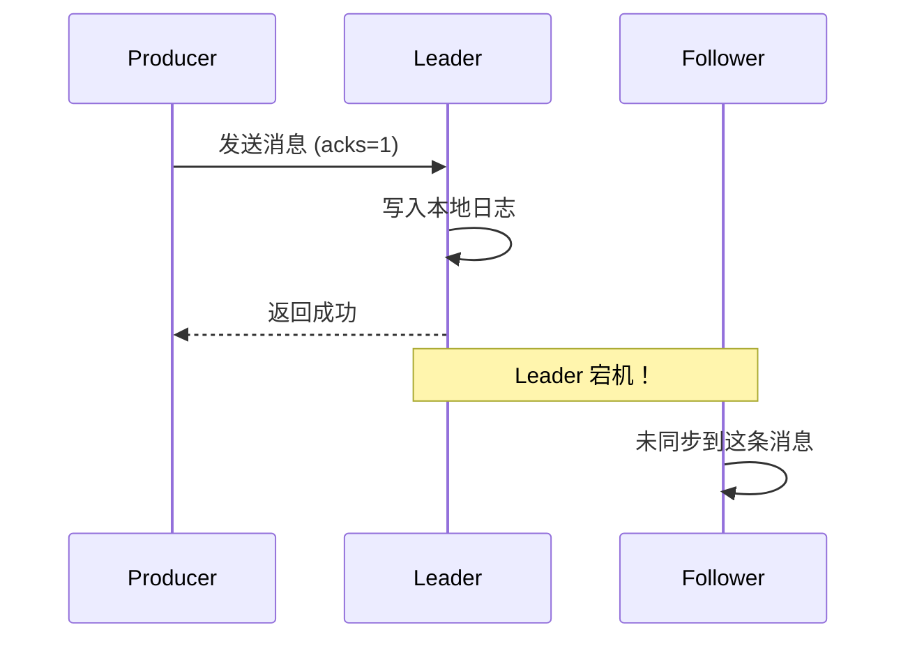

# Kafka 消息丢失与重复消费

> 上一节 [Kafka 顺序消息实现](/fw/mq/kafka/ordering) 提到顺序消息的实现往往配合幂等，但生产环境仍有丢消息和重复消费的隐患。

## 消息丢失的三个场景

### 场景一：生产者发送失败

网络抖动导致发送超时，Producer 没有收到确认：

```java
// 没有回调，异常没捕获
producer.send(new ProducerRecord<>("topic", "key", "value"));
// 网络抖动时这条消息可能就丢了

// ✅ 应该这样
producer.send(new ProducerRecord<>("topic", "key", "value"), (metadata, exception) -> {
    if (exception != null) {
        log.error("发送失败: {}", exception.getMessage());
        // 记录或重试
    }
});
```

### 场景二：Broker 宕机且副本不同步



当 `acks=1` 时，只有 Leader 写入成功就返回了。如果此时 Leader 宕机，Follower 还没同步，消息就丢了。

**解决**：使用 `acks=all` + `min.insync.replicas=2`

### 场景三：消费者先处理后提交 offset

```java
while (true) {
    ConsumerRecords<String, String> records = consumer.poll(Duration.ofMillis(100));
    for (ConsumerRecord<String, String> record : records) {
        process(record);  // 处理成功
        // 此时宕机，offset 还没提交
        // 重启后会重复消费
    }
    consumer.commitSync();  // 宕机前没执行到这里
}
```

## 重复消费的成因

网络超时、Consumer 重启、消费超时都会导致重复消费：

```java
// 场景：消费超时导致 rebalance
consumer.poll(Duration.ofMillis(100));  // 100ms 内没处理完
// 触发 Rebalance，重新分配 partition
// 新 Consumer 又从头消费，导致重复
```

## 幂等消费设计

### 方案一：Redis 去重

```java
public void consume(Message msg) {
    String msgId = msg.getMsgId();
    String key = "kafka:consumed:" + msg.getTopic() + ":" + msgId;

    // SETNX 原子操作，已存在则跳过
    if (redis.setnx(key, "1", Duration.ofDays(7))) {
        doProcess(msg);
    }
}
```

### 方案二：数据库唯一索引

```java
public void consume(OrderMessage msg) {
    try {
        // 利用唯一索引防重
        orderMapper.insertSelective(new Order() {{
            setId(msg.getOrderId());
            setStatus("PAID");
            setCreateTime(new Date());
        }});
    } catch (DuplicateKeyException e) {
        // 重复消息，忽略
    }
}
```

### 方案三：业务状态机

```java
public void consume(OrderMessage msg) {
    Order order = orderService.getById(msg.getOrderId());

    // 状态机：只有 PENDING 才能流转到 PAID
    if ("PAID".equals(order.getStatus())) {
        return;  // 已处理，跳过
    }

    if ("PENDING".equals(order.getStatus())) {
        order.setStatus("PAID");
        orderMapper.updateById(order);
    }
}
```

## 最佳实践

| 环节 | 配置/做法 |
|------|----------|
| 生产者 | `acks=all` + `retries=MAX` + 回调检查 |
| Broker | `replication.factor=3` + `min.insync.replicas=2` |
| 消费者 | 手动提交 + 幂等处理 |

---

*消息丢失与重复消费问题解决后，深入底层看 Kafka 如何高效存储：[Kafka 存储机制与日志分段](/fw/mq/kafka/storage)*
