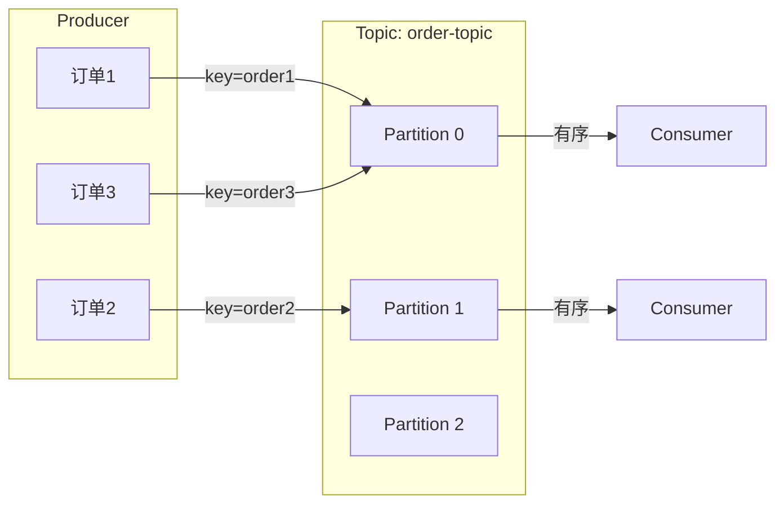

# Kafka 顺序消息实现

> 上一节 [Kafka 消息可靠性保证](/fw/mq/kafka/reliability) 提到 ISR 与副本机制是可靠性的基础，顺序消息的实现往往需要配合幂等。

## Kafka 顺序性保证的特点

Kafka 只保证**单 Partition 内有序**，不保证跨 Partition 有序。



**订单 1 → 订单 3** 在同一分区，有序；**订单 1 → 订单 2** 在不同分区，可能后发先到。

## 实现全局有序

### 方案一：单分区

所有消息发送到同一个 Partition，自然有序：

```java
// 指定固定 partition
producer.send(new ProducerRecord<>("order-topic", 0, "key", "value"));

// 或者用自定义分区器，把所有消息路由到同一个分区
props.put("partitioner.class", "com.example.SinglePartitionPartitioner");
```

**代价**：失去了并行消费能力，吞吐量受限于单分区。

### 方案二：业务 key 路由

业务上需要有序的消息，用同一 key 保证在同一分区：

```java
// 用订单 ID 作为 key，同一订单的消息一定在同一分区
producer.send(new ProducerRecord<>("order-topic", orderId, message));

// 消费者按分区消费
consumer.assign(Collections.singletonList(new TopicPartition("order-topic", 0)));
```

## 顺序消息消费模型

单分区顺序消费的 Consumer 必须是单线程：

```java
// ❌ 错误：多线程并发消费，顺序会被打乱
consumer.subscribe(Arrays.asList("order-topic"));
consumer.poll().forEach(record -> {
    executor.submit(() -> process(record));  // 并发处理
});

// ✅ 正确：单线程顺序处理
consumer.subscribe(Arrays.asList("order-topic"));
consumer.poll().forEach(this::processSequentially);
```

### 使用 MessageListenerOrderly

```java
consumer.subscribe("order-topic", new MessageListenerOrderly() {
    @Override
    public ConsumeOrderlyStatus consumeMessage(List<MessageExt> msgs, ConsumeOrderlyContext context) {
        for (MessageExt msg : msgs) {
            // 单线程顺序处理
            if (!process(msg)) {
                // 处理失败，暂停消费
                context.setSuspendCurrentQueueTimeMillis(1000);
                return ConsumeOrderlyStatus.SUSPEND_CURRENT_QUEUE_A_MOMENT;
            }
        }
        return ConsumeOrderlyStatus.SUCCESS;
    }
});
```

## 顺序性与吞吐量的权衡

| 场景 | 分区策略 | 顺序性 | 吞吐量 |
|------|----------|--------|--------|
| 全局有序 | 单分区 | ✅ 强 | ❌ 低 |
| 局部有序（同 ID） | 按 key 分区 | ✅ 业务有序 | ✅ 高 |
| 无顺序要求 | 随机分区 | ❌ 无 | ✅ 高 |

## 面试回答框架

**问题**：如何保证 Kafka 消息的顺序性？

**回答**：
1. Kafka 只保证单 Partition 内有序，需要用业务 key（如订单 ID）路由到同一分区
2. 消费者端，单分区的消费必须是单线程顺序处理
3. 结合幂等保证，即使重复消费也不会业务出错
4. 代价是失去了并行消费能力，吞吐量受限，需要根据业务权衡

---

*顺序消息依赖分区路由：[Kafka 消息丢失与重复消费](/fw/mq/kafka/message-loss) 分析实际场景的丢失与重复问题*
