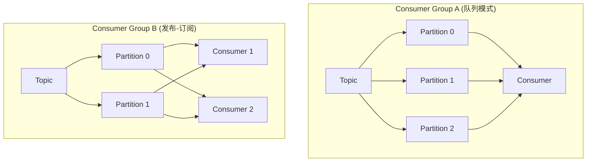

# Kafka 分区与消费者组

> 了解了 [Kafka 架构](/fw/mq/kafka/architecture)，分区和消费者组是实现并行消费的关键。

## 分区分配策略

当多个 Consumer 属于同一个 Consumer Group 时，Kafka 会将 Partition 分配给各个 Consumer。

### 三种分配策略

| 策略 | 特点 | 适用场景 |
|------|------|----------|
| Range | 按 Topic 分，每个 Topic 内部按范围分 | Consumer 数量稳定的场景 |
| RoundRobin | 跨 Topic 轮询 | 多 Topic 消费，消费不均时 |
| StickyAssignor | 尽量保持原有的分配关系 | Consumer 频繁变更，减少 Rebalance |

```java
// 指定分配策略
properties.put("partition.assignment.strategy", "org.apache.kafka.clients.consumer.StickyAssignor");
```

### Range vs RoundRobin 对比

假设 2 个 Consumer，3 个 Partition：

```
Range 分配：
  Consumer-1: [Partition-0, Partition-1]
  Consumer-2: [Partition-2]

RoundRobin 分配：
  Consumer-1: [Partition-0, Partition-2]
  Consumer-2: [Partition-1]
```

## 消费者组机制

Consumer Group 是 Kafka 实现**发布-订阅**和**队列**两种模式的核心：



- **同一个 Consumer Group**：消息只被一个 Consumer 消费（队列模式）
- **不同 Consumer Group**：每个 Group 都能消费到全部消息（发布-订阅模式）

## 消费者数量与分区数的关系

Consumer 数量和分区数的关系直接决定消费能力：

| 场景 | 说明 |
|------|------|
| Consumer < Partition | 一些 Consumer 会消费多个分区 |
| Consumer = Partition | 每个 Consumer 消费一个分区，最理想 |
| Consumer > Partition | 多余的 Consumer 闲置，无法消费 |

```java
// 查看分区分配情况
bin/kafka-consumer-groups.sh --describe --group my-group --bootstrap-server kafka:9092
```

输出示例：

```
GROUP           TOPIC           PARTITION  CURRENT-OFFSET  LOG-END-OFFSET  LAG
my-group        order-events    0          5000            5100            100
my-group        order-events    1          4800            4800            0
my-group        order-events    2          4900            5000            100
```

## Rebalance 机制

当 Consumer 组成员变化时，会触发 Rebalance：

**触发条件**：
- Consumer 订阅的 Topic 分区数变化
- Consumer 加入或离开 Group
- Consumer 心跳超时

**影响**：Rebalance 期间所有消费暂停，可能导致消费延迟。

### 减少 Rebalance 的配置

```java
properties.put("session.timeout.ms", 30000);      // 增大心跳超时
properties.put("max.poll.interval.ms", 300000); // 增大拉取间隔
properties.put("heartbeat.interval.ms", 10000);  // 增大心跳频率
```

:::warning
`max.poll.interval.ms` 设置过小会导致频繁 Rebalance，如果 Consumer 处理逻辑耗时长，需要适当调大。
:::

---

*分区分配策略影响消息顺序与可靠性，下一节 [Kafka 消息可靠性保证](/fw/mq/kafka/reliability)*
