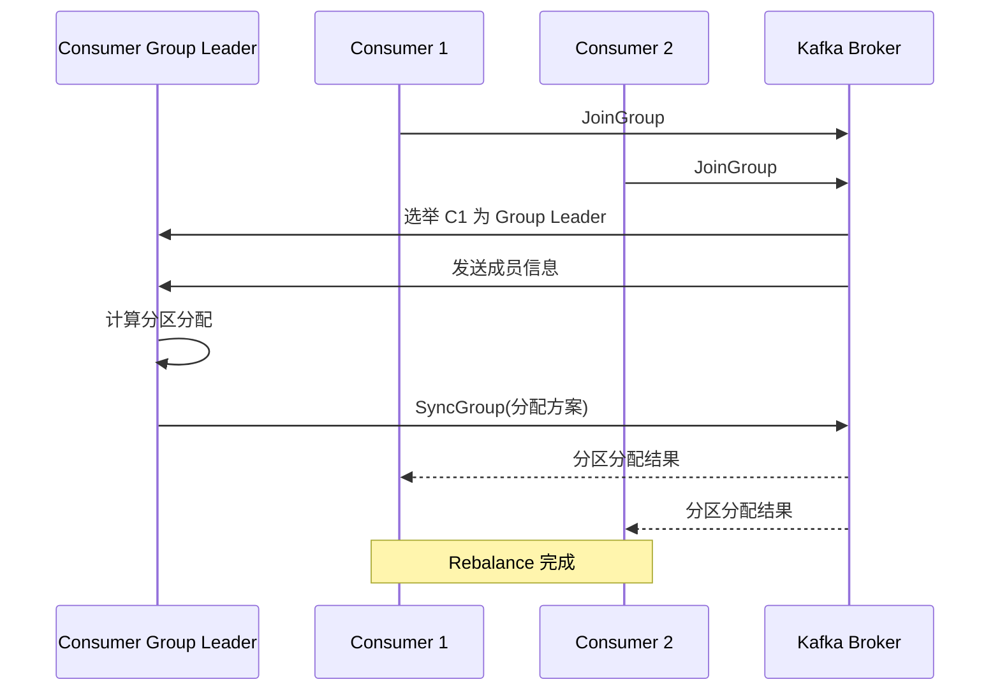

# Kafka Rebalance 机制

> 上一节 [Kafka 控制器选举](/fw/mq/kafka/controller) 提到 Controller 负责管理分区，Rebalance 是消费者层面的协调机制。

## 什么是 Rebalance

Rebalance 是 Consumer Group 内部分区所有权重新分配的过程：

```mermaid
graph TB
    subgraph "Rebalance 前"
        P1[Partition 0] --> C1[Consumer 1]
        P2[Partition 1] --> C2[Consumer 2]
        P3[Partition 2] --> C2
    end

    subgraph "Rebalance 后"
        P1a[Partition 0] --> C1a[Consumer 1]
        P2a[Partition 1] --> C3[Consumer 3 (新加入)]
        P3a[Partition 2] --> C2a[Consumer 2]
    end
```

## 触发条件

| 条件 | 说明 |
|------|------|
| Consumer 加入 Group | 新 Consumer 导致重新分配 |
| Consumer 离开 Group | Consumer 主动 unsubscribe |
| Consumer 心跳超时 | 被判定为宕机 |
| Topic 分区数变化 | 分区扩缩容 |
| Topic 订阅变化 | Consumer 改变订阅规则 |

## 三种分区分配策略

### RangeAssignor（默认）

按 Topic 分配，每个 Topic 内部按范围划分：

```
Topic A: [P0, P1, P2, P3]
Consumer: [C1, C2]

C1: P0, P1
C2: P2, P3
```

**问题**：如果多个 Topic，可能导致分配不均。

### RoundRobinAssignor

跨 Topic 轮询分配：

```
Topic A: [P0, P1, P2]
Topic B: [P0, P1, P2]
Consumer: [C1, C2]

C1: P0(Topic A), P1(Topic A), P0(Topic B)
C2: P2(Topic A), P2(Topic B), P1(Topic B)
```

### StickyAssignor

尽量保持原有分配，减少 Rebalance 影响：

```
Rebalance 前: C1=[P0,P1], C2=[P2]
Consumer 3 加入
Sticky: C1=[P0], C2=[P2], C3=[P1]  (最小化变更)
```

## Rebalance 流程



## 常见问题

### 1. 消费处理时间过长导致 Rebalance

```java
// ❌ 问题：处理时间超过 max.poll.interval.ms
while (true) {
    ConsumerRecords<String, String> records = consumer.poll(Duration.ofMillis(100));
    for (ConsumerRecord<String, String> record : records) {
        // 业务处理耗时 5 分钟
        doHeavyWork(record);
    }
    // 此时可能已触发 Rebalance
}
```

**解决**：将处理逻辑异步化，或增大 `max.poll.interval.ms`。

```java
// ✅ 优化：先 poll 快速提交，再异步处理
while (true) {
    ConsumerRecords<String, String> records = consumer.poll(Duration.ofMillis(100));
    List<Record> batch = new ArrayList<>();
    for (ConsumerRecord<String, String> record : records) {
        batch.add(new Record(record));
    }
    consumer.commitSync();  // 先提交
    // 异步处理
    executor.submit(() -> batch.forEach(this::doHeavyWork));
}
```

### 2. 心跳超时导致 Rebalance

```properties
# 合理配置
session.timeout.ms=30000       # 组成员超时
heartbeat.interval.ms=10000    # 心跳间隔（不要超过 session.timeout.ms 的 1/3）
max.poll.interval.ms=300000    # 拉取间隔
```

### 3. 频繁 Rebalance 排查

```bash
# 查看 Rebalance 事件
kafka-console-consumer.sh --bootstrap-server localhost:9092 \
    --group my-group --from-beginning --property print.key=true | \
    grep "Rebalance"

# 查看 Consumer 状态
bin/kafka-consumer-groups.sh --describe --group my-group --bootstrap-server localhost:9092
```

## 面试回答框架

**问题**：Kafka Rebalance 是如何触发的？有哪些优化方式？

**回答**：
1. 触发条件包括 Consumer 加入/离开、心跳超时、分区数变化等
2. Rebalance 期间所有消费暂停，影响吞吐量
3. 优化方式：合理配置 `session.timeout.ms`、`max.poll.interval.ms`
4. 使用 StickyAssignor 减少 Rebalance 影响
5. 避免在 poll 循环内做耗时的同步操作

---

*Rebalance 完成后，消费者从提交后的 offset 继续：[Kafka 日志压缩与清理策略](/fw/mq/kafka/cleanup)*
