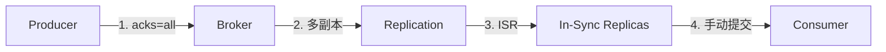

# Kafka 消息可靠性保证

> 上一节 [Kafka 分区与消费者组](/fw/mq/kafka/partition) 提到了 ISR，ISR 是 Kafka 可靠性保证的核心机制。

## 可靠性保障体系

Kafka 通过多重机制保证消息不丢失：



## 生产者端配置

### acks 参数

| 值 | 含义 | 可靠性 | 性能 |
|----|------|--------|------|
| `0` | 不等待确认 | 低，可能丢消息 | 最快 |
| `1` | Leader 确认 | 中 | 快 |
| `all` | 所有 ISR 确认 | 高 | 较慢 |

```java
// 最高可靠性配置
properties.put("acks", "all");
properties.put("retries", Integer.MAX_VALUE);  // 重试到成功
properties.put("enable.idempotence", true);   // 幂等发送
```

### enable.idempotence

幂等发送保证即使 Producer 重试，也不会产生重复消息：

```java
// 开启幂等后，Producer 会为每条消息分配唯一 PID
// 同一 Producer 发送的相同消息会被 Broker 去重
properties.put("enable.idempotence", true);
```

## Broker 端配置

### 多副本机制

```properties
# Topic 级别
replication.factor=3
min.insync.replicas=2

# Broker 级别 defaults
default.replication.factor=3
```

ISR = Leader + 同步中的 Follower。只要 ISR 数量 >= `min.insync.replicas`，就能保证消息不丢。

### 刷盘策略

```properties
# 同步刷盘（最安全，性能最差）
flush.messages=1
flush.ms=0

# 异步刷盘（默认，性能好，可能丢少量消息）
flush.messages=10000
flush.ms=1000
```

## 消费者端配置

消费者端的可靠性问题是**先消费后提交 offset**：

```java
// ❌ 错误：自动提交可能在消息未处理时就提交了
properties.put("enable.auto.commit", true);

// ✅ 正确：手动提交，处理完再提交
properties.put("enable.auto.commit", false);

// 消费后手动提交
while (true) {
    ConsumerRecords<String, String> records = consumer.poll(Duration.ofMillis(100));
    for (ConsumerRecord<String, String> record : records) {
        process(record);
    }
    consumer.commitSync();  // 处理完再提交
}
```

## 可靠性配置汇总

```java
Properties props = new Properties();
props.put("bootstrap.servers", "kafka:9092");
props.put("key.serializer", "StringSerializer");
props.put("value.serializer", "StringSerializer");

// 生产者可靠性配置
props.put("acks", "all");
props.put("retries", Integer.MAX_VALUE);
props.put("enable.idempotence", true);
props.put("max.in.flight.requests.per.connection", 5);  // 幂等下允许乱序

// 消费者可靠性配置
props.put("group.id", "reliable-consumer");
props.put("enable.auto.commit", false);
props.put("auto.offset.reset", "earliest");
```

## 可靠性与性能权衡

| 场景 | acks | min.insync.replicas | 性能 |
|------|------|---------------------|------|
| 高可靠（金融） | all | 2 | 慢 |
| 平衡 | 1 | 1 | 中 |
| 高吞吐（日志） | 0 | 1 | 快 |

---

*可靠性有了保障，但消息丢失和重复消费的具体场景是什么？[Kafka 顺序消息实现](/fw/mq/kafka/ordering)*
