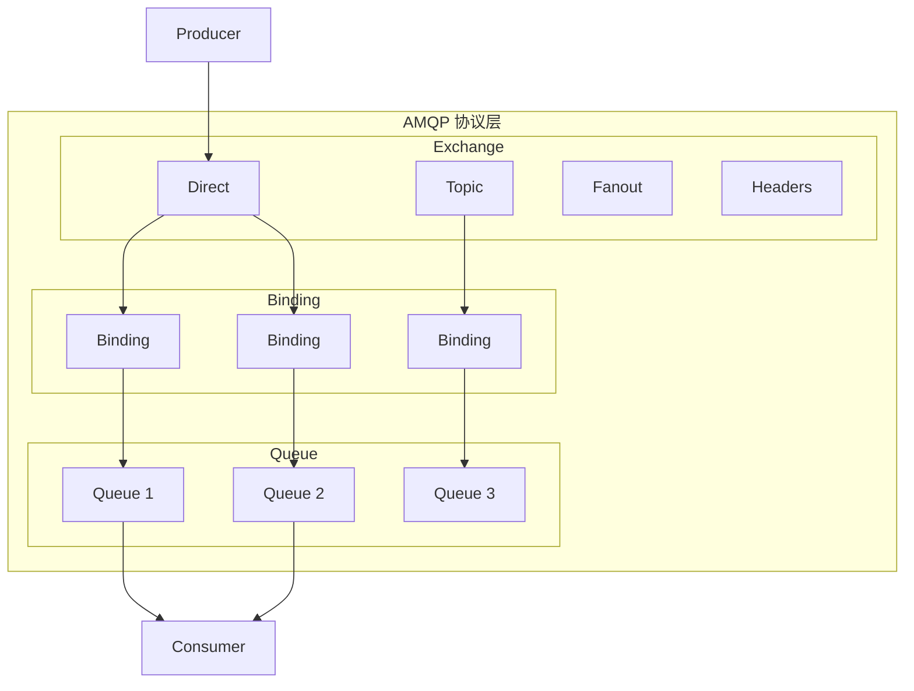

# RabbitMQ 架构与 AMQP 协议

> 上一节 [RocketMQ 高可用机制](/fw/mq/rocketmq/ha) 完结了 RocketMQ 篇，接下来看另一套基于 AMQP 协议的灵活 MQ：RabbitMQ。

## AMQP 协议模型

AMQP（Advanced Message Queuing Protocol）是应用层协议，定义了消息传递的模型：



## RabbitMQ 核心组件

| 组件 | 作用 |
|------|------|
| Producer | 消息生产者，发送消息到 Exchange |
| Exchange | 消息路由器，根据规则路由到 Queue |
| Binding | Exchange 和 Queue 的绑定关系 |
| Queue | 消息存储队列 |
| Consumer | 消息消费者，从 Queue 拉取消息 |
| Connection | TCP 连接 |
| Channel | 虚拟连接，复用 Connection |

## Exchange 的四种类型

| 类型 | 路由规则 | 典型场景 |
|------|----------|----------|
| Direct | 完全匹配 Routing Key | 点对点通信 |
| Topic | 模式匹配（`*` `#`） | 通配符匹配 |
| Fanout | 广播到所有 Queue | 广播通知 |
| Headers | 按消息头属性匹配 | 属性路由 |

## 与 Kafka 的核心区别

| 维度 | RabbitMQ | Kafka |
|------|----------|-------|
| 架构模型 | Exchange + Queue | Topic + Partition |
| 消息模式 | 拉取（Pull） | 推送（Push） |
| 吞吐量 | 万级/s | 10万+/s |
| 延迟 | 微秒级 | ms 级 |
| 消息堆积 | 有限（内存） | TB 级 |
| 消息有序 | 单 Queue 有序 | 单 Partition 有序 |

## 核心配置

```java
ConnectionFactory factory = new ConnectionFactory();
factory.setHost("localhost");
factory.setPort(5672);
factory.setUsername("guest");
factory.setPassword("guest");

Connection connection = factory.newConnection();
Channel channel = connection.createChannel();

// 声明 Exchange
channel.exchangeDeclare("my-exchange", BuiltinExchangeType.DIRECT, true);

// 声明 Queue
channel.queueDeclare("my-queue", true, false, false, null);

// 绑定
channel.queueBind("my-queue", "my-exchange", "my-routing-key");
```

---

*Exchange 是 RabbitMQ 的核心：[交换机类型（Direct/Topic/Fanout/Headers）](/fw/mq/rabbitmq/exchange-types)*
