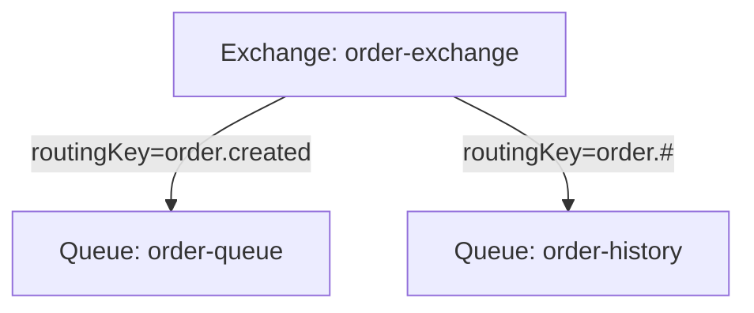
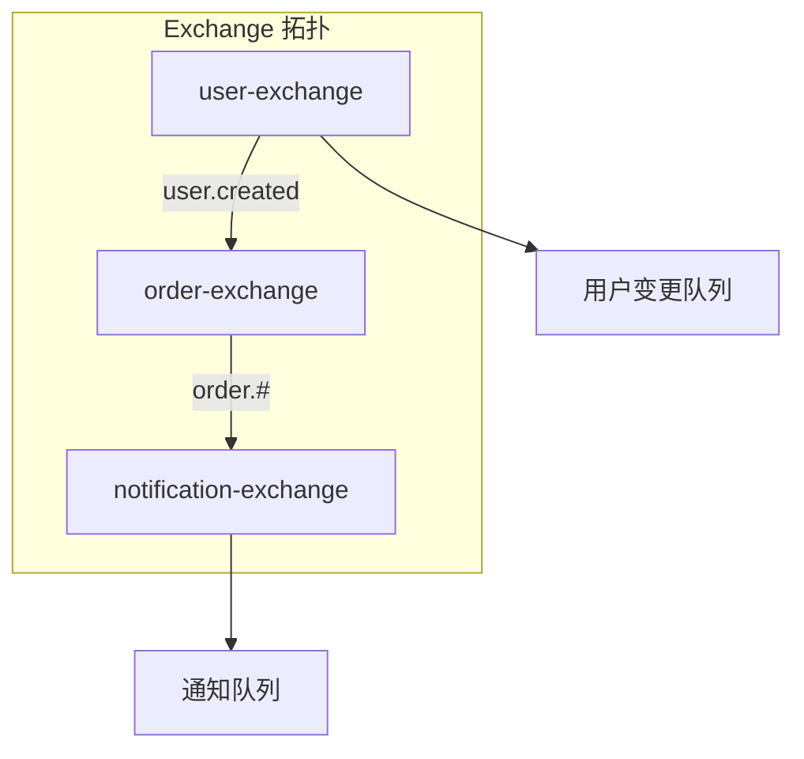

# Binding 与 Routing Key

> 上一节 [Queue 与消息存储机制](/fw/mq/rabbitmq/queue) 提到消息存储在 Queue，Binding 是连接 Exchange 和 Queue 的桥梁。

## Binding 是什么

Binding 是 Exchange 和 Queue 之间的绑定关系，包含 Routing Key：

```java
// 创建 Binding
channel.queueBind(queueName, exchangeName, routingKey);
channel.exchangeBind(destinationExchange, sourceExchange, routingKey);
```

## Binding 的结构



**BindingKey** 是 Exchange 绑定的规则，**RoutingKey** 是消息发送时的路由键。

## Routing Key 匹配规则

| Exchange 类型 | 匹配规则 |
|---------------|----------|
| Direct | BindingKey == RoutingKey（完全匹配） |
| Topic | RoutingKey 匹配 BindingKey（通配符） |
| Fanout | 忽略 RoutingKey |
| Headers | 消息头匹配 Binding 参数 |

## Topic 匹配示例

### 通配符说明

```java
// Binding Key 示例
"order.created"      // 精确匹配 order.created
"order.*"            // 匹配 order.created, order.updated
"order.#"            // 匹配 order, order.created, order.created.paid

// * 匹配一个单词
// # 匹配零个或多个单词
```

### 匹配场景

```
消息: order.created.paid

Binding: order.created     ✗ 不匹配
Binding: order.*          ✗ 不匹配（#.* 能匹配）
Binding: order.#           ✓ 匹配
Binding: #.paid           ✓ 匹配
Binding: #                ✓ 匹配
```

## 绑定管理

### 查看绑定

```bash
# 查看所有绑定
rabbitmqctl list_bindings

# 输出示例
binding_name    binding_properties     source      destination     routing_key
exchange_name   queue_name            ...         order-queue     order.created
```

### 解绑

```java
// 解绑
channel.queueUnbind(queueName, exchangeName, routingKey);

// 重新绑定
channel.queueBind(queueName, exchangeName, newRoutingKey);
```

## Exchange 之间的绑定

RabbitMQ 支持 Exchange 级联：

```java
// exchangeA 的消息会自动路由到 exchangeB
channel.exchangeBind("exchangeB", "exchangeA", "order.#");
```

### 应用场景



## 设计最佳实践

### 命名规范

```java
// 推荐的命名方式
exchange: {业务线}.{环境}.{功能}
queue: {业务线}.{模块}.{用途}
routingKey: {实体}.{事件}.{操作}

// 示例
exchange: order.service.events
queue: order.service.fulfillment.process
routingKey: order.created.process
```

### 避免过度绑定

```java
// ❌ 问题：Binding 过多，难以管理
channel.queueBind("q1", "ex", "a");
channel.queueBind("q1", "ex", "b");
channel.queueBind("q1", "ex", "c");

// ✅ 改进：使用 Topic Exchange，统一管理
channel.queueBind("q1", "ex", "a.#");
// 或使用多个 Exchange 分层
```

## 面试回答框架

**问题**：RabbitMQ 的 Routing Key 和 Binding Key 有什么区别？

**回答**：
1. Routing Key 是消息发送时指定的路由键
2. Binding Key 是 Exchange 和 Queue 绑定时指定的规则
3. 消息路由时，Broker 会将 Routing Key 与 Binding Key 匹配
4. 不同 Exchange 类型有不同的匹配规则

---

*了解 Binding 后，[消息可靠性投递（Confirm/Return）](/fw/mq/rabbitmq/reliability) 讲解如何确保消息可靠发送*
