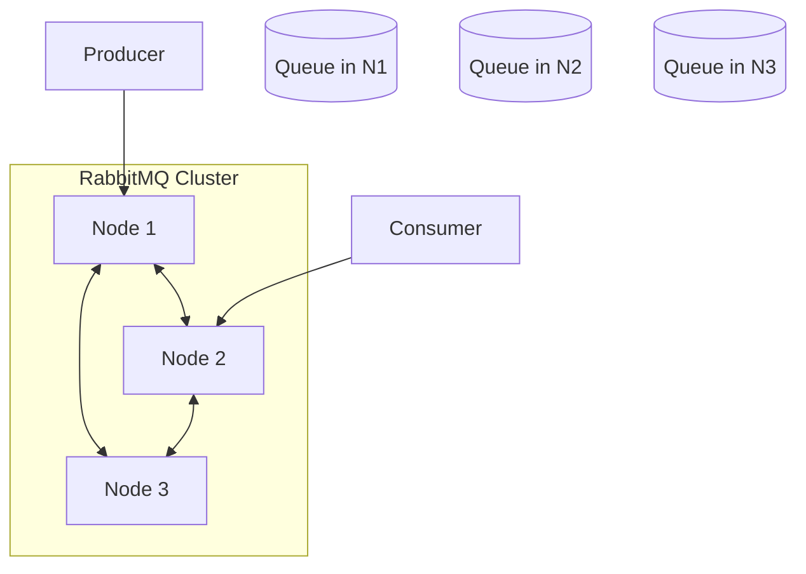
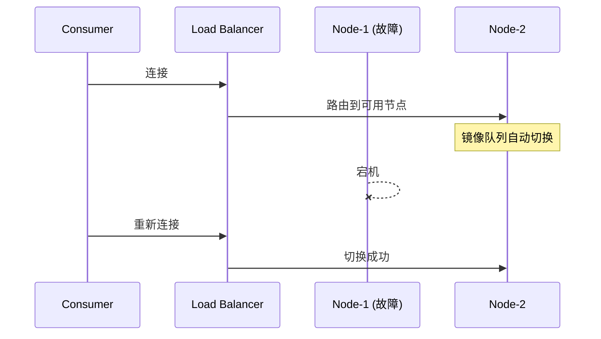

# RabbitMQ 集群与镜像队列

> 上一节 [消息幂等性与去重](/fw/mq/rabbitmq/idempotency) 讲解消息幂等，高可用集群保证消息不丢失。

## 集群架构

RabbitMQ 集群允许多个节点共享 Queue：



## 集群类型

### 普通集群

```bash
# 节点 1
rabbitmq-server -detached
rabbitmqctl stop_app
rabbitmqctl join_cluster rabbit@node2
rabbitmqctl start_app

# 节点 2
rabbitmq-server -detached
```

**特点**：
- Queue 只存在于一个节点
- 其他节点只保存 Queue 元数据
- 节点宕机，Queue 不可用

### 镜像队列（推荐）

Queue 内容同步到多个节点：

```bash
# 创建镜像策略
rabbitmqctl set_policy ha-all "^order\." \
    '{"ha-mode":"all","ha-sync-mode":"automatic"}'
```

## 镜像队列配置

### ha-mode 参数

| 值 | 说明 |
|----|------|
| `all` | 镜像到所有节点 |
| `exactly` | 镜像到指定数量节点 |
| `nodes` | 镜像到指定节点列表 |

### ha-sync-mode

| 值 | 说明 |
|----|------|
| `manual` | 手动同步（默认） |
| `automatic` | 自动同步 |

### 通过 Management UI 配置

```
Admin -> Policies -> Add / Update a policy

Name: ha-order
Pattern: ^order\.
Apply to: Queues
Definition: ha-mode=all, ha-sync-mode=automatic
Priority: 0
```

## 高可用配置示例

```properties
# rabbitmq.conf 配置
cluster_formation.peer_discovery_backend = rabbit_peer_discovery_classic_config

cluster_formation.classic_config.nodes.1 = rabbit@node1
cluster_formation.classic_config.nodes.2 = rabbit@node2
cluster_formation.classic_config.nodes.3 = rabbit@node3

# 镜像队列策略
镜像策略通过 rabbitmqctl 或 Management UI 配置
```

## 负载均衡

### HAProxy 配置

```haproxy
listen rabbitmq_cluster
    bind 0.0.0.0:5672
    mode tcp
    balance roundrobin

    server rabbit1 192.168.1.1:5672 check inter 2000 rise 2 fall 3
    server rabbit2 192.168.1.2:5672 check inter 2000 rise 2 fall 3
    server rabbit3 192.168.1.3:5672 check inter 2000 rise 2 fall 3
```

## 故障切换



## 监控

```bash
# 查看集群状态
rabbitmqctl cluster_status

# 查看镜像队列状态
rabbitmqctl list_queues name synchronised_slave_nodes

# 查看 policies
rabbitmqctl list_policies
```

## 与 Kafka 高可用对比

| 维度 | RabbitMQ 镜像队列 | Kafka 多副本 |
|------|-------------------|--------------|
| 数据同步 | 主从同步 | ISR 同步 |
| 故障切换 | 手动/自动 | 自动 |
| 数据一致性 | 最终一致 | 可配置 |
| 切换时间 | 秒级 | ms 级 |

## 面试回答框架

**问题**：RabbitMQ 如何实现高可用？

**回答**：
1. 普通集群：Queue 只在主节点，其他节点保存元数据
2. 镜像队列：Queue 内容同步到多个节点
3. 配置镜像策略：`ha-mode=all` 镜像到所有节点
4. 配合负载均衡器，实现故障自动切换
5. 注意：镜像队列是最终一致，可能有短暂数据不一致

---

*集群保证高可用，[RabbitMQ 权限管理与安全](/fw/mq/rabbitmq/security) 讲解安全配置*
