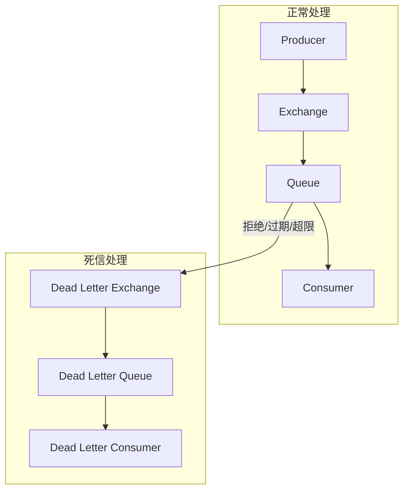

# 死信队列（DLX）应用场景

> 上一节 [消息可靠性投递](/fw/mq/rabbitmq/reliability) 提到消息确认，消息消费失败后如何处理？死信队列（Dead Letter Queue）是解决方案。

## 什么是死信队列

当消息在 Queue 中被拒绝、过期或超出队列限制时，会进入 DLX：



## 触发条件

| 条件 | 说明 |
|------|------|
| 拒绝消费 | Consumer 拒绝消息（nack/reject）且不重入队列 |
| 消息过期 | 消息 TTL 到期 |
| 队列满 | Queue 达到最大长度，新消息被丢弃 |

## 配置死信队列

### 方式一：Queue 参数配置

```java
Map<String, Object> args = new HashMap<>();
// 指定死信交换机
args.put("x-dead-letter-exchange", "dlx-exchange");
// 指定死信路由键
args.put("x-dead-letter-routing-key", "dlx.routing.key");

// 创建队列时指定
channel.queueDeclare("order-queue", true, false, false, args);

// 声明死信队列
channel.exchangeDeclare("dlx-exchange", BuiltinExchangeType.DIRECT, true);
channel.queueDeclare("order-dlq", true, false, false, null);
channel.queueBind("order-dlq", "dlx-exchange", "dlx.routing.key");
```

### 方式二：Exchange 参数配置

```java
// 为 Exchange 添加 DLX
Map<String, Object> args = new HashMap<>();
args.put("x-dead-letter-exchange", "dlx-exchange");
args.put("x-dead-letter-routing-key", "dlx.routing.key");

channel.exchangeDeclare("order-exchange", BuiltinExchangeType.DIRECT, true, args);
```

## 应用场景

### 场景一：消息重试

```java
// Consumer 消费失败，将消息拒绝但不重新入队
@RabbitListener(queues = "order-queue")
public void handleOrder(Message message, Channel channel) throws IOException {
    try {
        processOrder(message);
        channel.basicAck(message.getMessageProperties().getDeliveryTag(), false);
    } catch (Exception e) {
        // 消费失败，拒绝消息，进入 DLQ
        // 可设置重试次数判断
        channel.basicNack(message.getMessageProperties().getDeliveryTag(),
                         false, false);
    }
}
```

### 场景二：延迟消息

利用消息 TTL 实现延迟：

```java
// 1. 创建延迟队列（TTL=10秒）
Map<String, Object> delayArgs = new HashMap<>();
delayArgs.put("x-message-ttl", 10000);  // 10秒
delayArgs.put("x-dead-letter-exchange", "order-exchange");
delayArgs.put("x-dead-letter-routing-key", "order.process");

channel.queueDeclare("order-delay-queue", true, false, false, delayArgs);

// 2. 发送消息到延迟队列
channel.basicPublish("", "order-delay-queue", properties, body);

// 3. 10秒后，消息过期，进入死信交换机
// 4. 死信交换机路由到正常队列
```

### 场景三：消息确认超时

```java
// 设置消息过期时间为 30 秒
AMQP.BasicProperties properties = new AMQP.BasicProperties.Builder()
    .expiration("30000")  // 30 秒
    .build();

channel.basicPublish("order-exchange", "order.created", properties, body);
```

## 死信队列消费

```java
@RabbitListener(queues = "order-dlq")
public void handleDeadLetter(Message message, Channel channel) throws IOException {
    try {
        // 记录死信日志
        log.error("处理死信: {}", new String(message.getBody()));

        // 分析死信原因
        Map<String, Object> headers = message.getMessageProperties().getHeaders();
        String deathReason = (String) headers.get("x-first-death-reason");

        if ("rejected".equals(deathReason)) {
            // 被拒绝的消息，可能是业务问题
            handleRejected(message);
        } else if ("expired".equals(deathReason)) {
            // 过期的消息
            handleExpired(message);
        }

        channel.basicAck(message.getMessageProperties().getDeliveryTag(), false);
    } catch (Exception e) {
        // 处理失败，重新入队
        channel.basicNack(message.getMessageProperties().getDeliveryTag(), false, true);
    }
}
```

## 死信原因详解

| x-first-death-reason | 说明 |
|----------------------|------|
| `rejected` | 消息被 Consumer 拒绝 |
| `expired` | 消息 TTL 过期 |
| `maxlength` | 队列满被丢弃 |
| `maxlength-bytes` | 队列大小超限 |

## 面试回答框架

**问题**：RabbitMQ 死信队列有什么用？

**回答**：
1. 收集处理失败的消息，避免丢失
2. 实现消息重试机制
3. 实现延迟消息
4. 监控和分析消息失败原因
5. 业务上用于补偿处理或人工介入

---

*死信队列用于处理异常消息，[延迟队列与延迟插件](/fw/mq/rabbitmq/delay-queue) 讲解更灵活的延迟实现*
