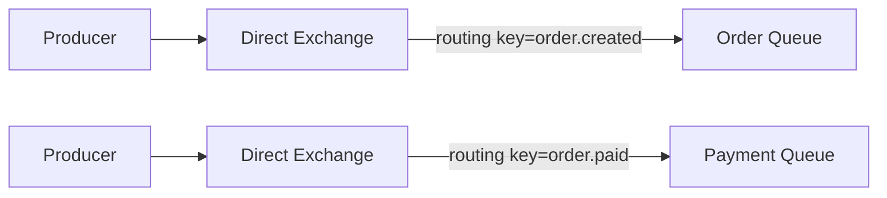
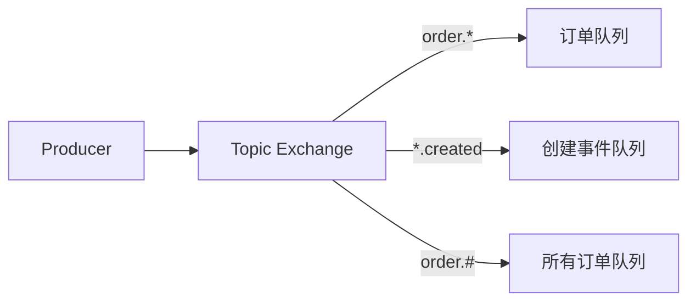
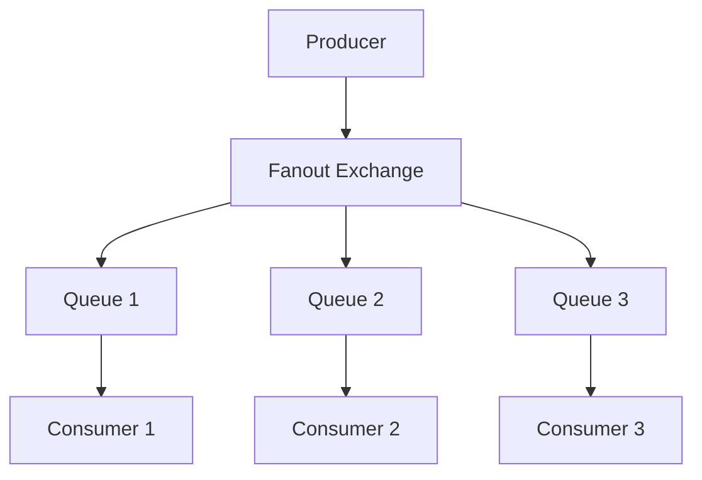

# 交换机类型（Direct/Topic/Fanout/Headers）

> 上一节 [RabbitMQ 架构与 AMQP 协议](/fw/mq/rabbitmq/architecture) 提到 Exchange 是消息路由的核心。

## Direct Exchange

### 路由规则

完全匹配 Routing Key：



### 代码示例

```java
// 声明 Direct Exchange
channel.exchangeDeclare("order-exchange", BuiltinExchangeType.DIRECT, true);

// 声明 Queue
channel.queueDeclare("order-queue", true, false, false, null);

// 绑定，routing key = order.created
channel.queueBind("order-queue", "order-exchange", "order.created");
channel.queueBind("order-queue", "order-exchange", "order.updated");

// 发送消息
channel.basicPublish("order-exchange", "order.created", null, messageBody);
```

### 使用场景

- 订单状态变更通知
- 用户操作日志分类
- 精确消息路由

## Topic Exchange

### 路由规则

支持通配符匹配：

| 通配符 | 说明 | 示例 |
|--------|------|------|
| `*` | 匹配一个单词 | `order.*` 匹配 `order.created` |
| `#` | 匹配零个或多个单词 | `order.#` 匹配 `order.created`、`order.created.paid` |



### 代码示例

```java
channel.exchangeDeclare("event-exchange", BuiltinExchangeType.TOPIC, true);

// 绑定规则
channel.queueBind("order-queue", "event-exchange", "order.*");      // order.created, order.updated
channel.queueBind("log-queue", "event-exchange", "#.error");        // 所有 error 日志
channel.queueBind("all-order-queue", "event-exchange", "order.#");   // order 所有事件
```

### 使用场景

- 日志收集（按级别、来源分类）
- 事件总线（灵活的事件订阅）
- 多租户消息路由

## Fanout Exchange

### 路由规则

忽略 Routing Key，广播到所有绑定的 Queue：



### 代码示例

```java
channel.exchangeDeclare("notification-exchange", BuiltinExchangeType.FANOUT, true);

// 多个 Queue 绑定
channel.queueBind("email-queue", "notification-exchange", "");
channel.queueBind("sms-queue", "notification-exchange", "");
channel.queueBind("push-queue", "notification-exchange", "");

// 发送消息，所有绑定的 Queue 都能收到
channel.basicPublish("notification-exchange", "", null, messageBody);
```

### 使用场景

- 系统通知广播
- 配置变更同步
- 多渠道消息推送

## Headers Exchange

### 路由规则

根据消息头的属性匹配：

```java
// 发送带 Header 的消息
Map<String, Object> headers = new HashMap<>();
headers.put("content-type", "application/json");
headers.put("priority", 1);

AMQP.BasicProperties properties = new AMQP.BasicProperties.Builder()
    .headers(headers)
    .build();

channel.basicPublish("header-exchange", "", properties, messageBody);

// 绑定时指定匹配规则
Map<String, Object> bindingArgs = new HashMap<>();
bindingArgs.put("x-match", "all");  // all=全部匹配，any=任一匹配
bindingArgs.put("content-type", "application/json");
bindingArgs.put("priority", 1);

channel.queueBind("json-high-priority-queue", "header-exchange", "", bindingArgs);
```

### x-match 取值

| 值 | 说明 |
|----|------|
| `all` | 所有属性必须匹配 |
| `any` | 任一属性匹配即可 |

### 使用场景

- 多维度消息过滤
- 复杂路由规则

## 四种 Exchange 对比

| 类型 | Routing Key | 性能 | 复杂度 | 典型场景 |
|------|-------------|------|--------|----------|
| Direct | 精确匹配 | 最高 | 低 | 点对点 |
| Topic | 通配符匹配 | 高 | 中 | 灵活订阅 |
| Fanout | 忽略 | 高 | 低 | 广播 |
| Headers | 属性匹配 | 中 | 高 | 多维度路由 |

## 面试回答框架

**问题**：RabbitMQ 有哪些 Exchange 类型？分别用在什么场景？

**回答**：
1. Direct：精确匹配 Routing Key，用于点对点通信
2. Topic：通配符匹配，适合灵活的事件订阅
3. Fanout：广播到所有 Queue，适合通知广播
4. Headers：按消息头属性匹配，适合多维度路由

---

*Exchange 路由到 Queue 后，[Queue 与消息存储机制](/fw/mq/rabbitmq/queue) 讲解消息如何存储*
