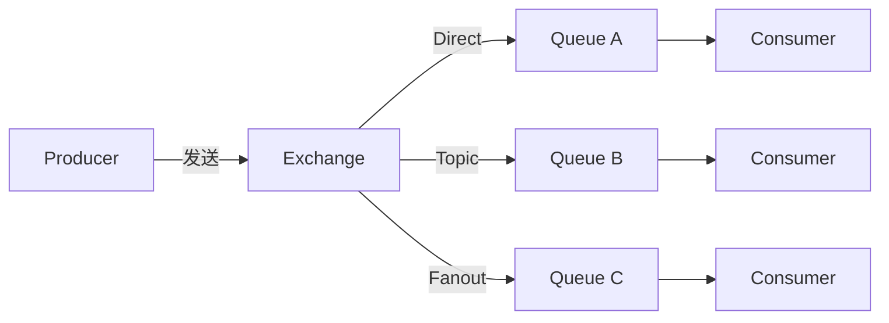

# RabbitMQ

> 基于 Erlang 开发的开源消息代理，完整实现了 AMQP 0-9-1 协议，以灵活的路由规则、低延迟、丰富的特性著称。

## 核心定位

RabbitMQ 与 Kafka、RocketMQ 的设计哲学完全不同：Kafka/RocketMQ 是"日志流"，适合高吞吐顺序写入；RabbitMQ 是"消息路由器"，适合复杂的路由逻辑、灵活的交换机类型、消息级别的 TTL 控制。它的延迟可以做到 μs 级，是金融报价、实时推送等对延迟敏感场景的首选。

## 学习路径

按"协议 → 路由 → 可靠性 → 高级特性 → 集群运维"的递进展开：

### 基础架构与协议

| 文章 | 重点 | 何时阅读 |
|------|------|----------|
| [架构与 AMQP 协议](/fw/mq/rabbitmq/architecture) | Exchange / Queue / Binding / Channel | 第一次接触 RabbitMQ |
| [Queue 与消息存储机制](/fw/mq/rabbitmq/queue) | 持久化、内存管理、消息流控 | 排查消息堆积 |

### 路由机制

| 文章 | 重点 | 何时阅读 |
|------|------|----------|
| [交换机类型](/fw/mq/rabbitmq/exchange-types) | Direct / Topic / Fanout / Headers | 选型决策点 |
| [Binding 与 Routing Key](/fw/mq/rabbitmq/binding) | 路由规则、绑定关系 | 设计路由策略 |

### 可靠性与高级特性

| 文章 | 重点 | 何时阅读 |
|------|------|----------|
| [消息可靠性投递](/fw/mq/rabbitmq/reliability) | Confirm / Return / 事务 | 数据不能丢 |
| [死信队列](/fw/mq/rabbitmq/dead-letter) | DLX、消息重试、异常处理 | 消费失败兜底 |
| [延迟队列与延迟插件](/fw/mq/rabbitmq/delay-queue) | TTL+DLX / rabbitmq-delayed-message | 超时取消场景 |
| [TTL 消息与优先级队列](/fw/mq/rabbitmq/ttl-priority) | 消息 TTL、队列 TTL、优先级 | 精细化消息控制 |
| [消息幂等性与去重](/fw/mq/rabbitmq/idempotency) | 唯一 ID、Redis 去重表 | 防止重复消费 |

### 集群与运维

| 文章 | 重点 | 何时阅读 |
|------|------|----------|
| [集群与镜像队列](/fw/mq/rabbitmq/cluster) | 普通集群 vs 镜像队列、HAProxy | 生产环境部署 |
| [权限管理与安全](/fw/mq/rabbitmq/security) | 用户、vhost、ACL、TLS | 多团队协作环境 |
| [常见问题与排查](/fw/mq/rabbitmq/troubleshooting) | 内存告警、磁盘满、连接数耗尽 | 线上问题排查手册 |

## 核心特性对照

| 特性 | RabbitMQ | Kafka | RocketMQ |
|------|----------|-------|----------|
| 协议 | AMQP 0-9-1 | 自定义协议 | 自定义协议 |
| 延迟 | μs 级 | ms 级 | ms 级 |
| 路由灵活性 | 4 种交换机 + 灵活 Binding | 仅按 Partition | Tag + SQL92 |
| 消息堆积 | GB 级，注意内存 | TB 级 | TB 级 |
| 事务消息 | 不支持 | 支持 | 原生支持 |
| 延迟消息 | TTL+DLX / 插件 | 不支持 | 18 级别 + 任意时间 |
| 集群方式 | 普通集群 / 镜像队列 | Broker + ZK/KRaft | 主从 + Dledger |

## 常见疑问

**RabbitMQ 适合什么场景？**
复杂路由（Topic 模式 + 通配符）、低延迟业务（金融报价、IoT 推送）、需要灵活的消息属性控制（TTL、优先级、Header）。

**RabbitMQ 不适合什么场景？**
超大规模日志流（Kafka 更优）、严格事务消息（RocketMQ 更优）、消息堆积 TB 级（Kafka/RocketMQ 更优，RabbitMQ 内存压力大）。

**为什么用 Erlang 实现？**
Erlang 天生支持分布式、并发、容错，Actor 模型让单个 Broker 能轻松管理百万级连接。这也是 RabbitMQ 延迟能做到 μs 级的原因。

---

*MQ 内容到此结束，下一站 [RPC 与注册中心](/fw/rpc) 学习服务间同步通信方案*