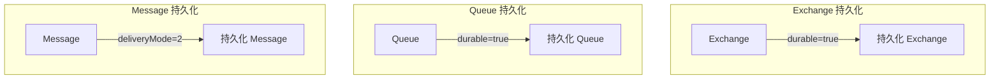
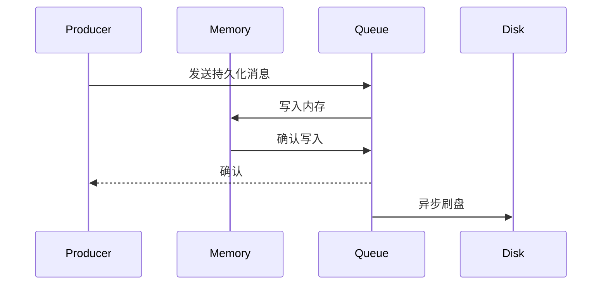

# Queue 与消息存储机制

> 上一节 [交换机类型](/fw/mq/rabbitmq/exchange-types) 提到消息路由到 Queue，Queue 是 RabbitMQ 的消息存储单元。

## Queue 的特性

### 基本操作

```java
// 声明 Queue
channel.queueDeclare("my-queue", durable, exclusive, autoDelete, arguments);

// 参数说明
// durable: 持久化，重启后 Queue 仍然存在
// exclusive: 独占，只允许一个连接使用
// autoDelete: 自动删除，无 Consumer 时删除
// arguments: 扩展参数
```

### Queue 的特点

| 特性 | 说明 |
|------|------|
| FIFO | 消息按先进先出顺序消费 |
| 单次消费 | 消息被消费后从 Queue 删除 |
| 多 Consumer | 一个 Queue 可被多个 Consumer 订阅 |

## 消息持久化

RabbitMQ 持久化分为三个层次：



### 代码实现

```java
// 1. Exchange 持久化
channel.exchangeDeclare("my-exchange", BuiltinExchangeType.DIRECT, true);

// 2. Queue 持久化
channel.queueDeclare("my-queue", true, false, false, null);

// 3. Message 持久化
AMQP.BasicProperties properties = new AMQP.BasicProperties.Builder()
    .deliveryMode(2)  // 持久化
    .contentType("application/json")
    .build();

channel.basicPublish("my-exchange", "my-routing-key", properties, messageBody);
```

### 持久化配置

| 配置 | 说明 | 性能影响 |
|------|------|----------|
| Exchange durable | 持久化 | 低 |
| Queue durable | 持久化 | 低 |
| Message deliveryMode=2 | 持久化 | 中等（写盘） |

## 消息存储机制

### 队列结构

```
Queue: my-queue
├── messages RAM (内存消息)
├── messages Paged Out (换页到磁盘)
├── messages Persistent (磁盘消息)
└── index (消息索引)
```

### 内存与磁盘管理

RabbitMQ 会将消息从内存换页到磁盘：

```properties
# 配置内存阈值（默认 0.4，即内存 40% 时触发换页）
vm_memory_high_watermark.relative=0.6

# 强制换页阈值
vm_memory_high_watermark.paging_ratio=0.75
```

### 持久化消息写入



## 消息堆积处理

### 查看队列状态

```bash
# 查看所有队列
rabbitmqctl list_queues name messages messages_ready messages_unacknowledged

# 查看队列详情
rabbitmqctl list_queues name durable memory details
```

### 消息堆积原因

| 原因 | 表现 | 解决 |
|------|------|------|
| Consumer 宕机 | unacknowledged 增多 | 重启 Consumer |
| Consumer 处理慢 | messages_ready 增多 | 优化处理逻辑 |
| 网络问题 | 连接断开 | 检查网络 |

### 监控告警

```bash
# 设置内存告警
rabbitmqctl set_parameter alarms disk-alarm-threshold 1000000000

# 设置磁盘告警
rabbitmqctl set_parameter alarms disk-alarm-threshold 50000000000
```

## 面试回答框架

**问题**：RabbitMQ 如何保证消息不丢失？

**回答**：
1. Exchange、Queue、Message 三层持久化
2. Publisher Confirm 确认消息到达 Broker
3. Consumer 手动 ACK 确认消费
4. 集群镜像队列保证高可用

---

*Queue 的消息如何被 Consumer 消费：[Binding 与 Routing Key](/fw/mq/rabbitmq/binding)*
