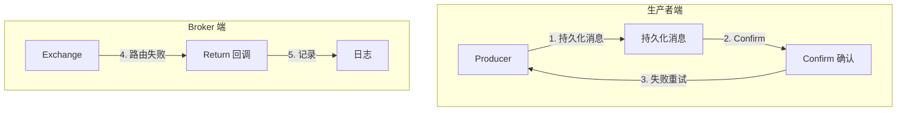

# 消息可靠性投递（Confirm/Return）

> 上一节 [Binding 与 Routing Key](/fw/mq/rabbitmq/binding) 讲解了消息路由，本节讲解如何确保消息可靠到达。

## 消息投递的四个环节


每个环节都可能失败，需要对应的确认机制。

## Publisher Confirm

### 开启 Confirm 模式

```java
// 开启 Publisher Confirm
channel.confirmSelect();

// 异步监听确认
channel.addConfirmListener((deliveryTag, multiple) -> {
    // 消息确认到达 Broker
    System.out.println("消息确认: " + deliveryTag);
}, (deliveryTag, multiple) -> {
    // 消息未确认（NACK）
    System.out.println("消息未确认: " + deliveryTag);
    // 重发或记录
});
```

### 三种确认模式

```java
// 1. 单条确认（同步）
channel.confirmSelect();
channel.basicPublish(exchange, routingKey, properties, body);
channel.waitForConfirmsOrDie(5000);  // 等待确认

// 2. 批量确认（同步）
channel.confirmSelect();
for (int i = 0; i < 100; i++) {
    channel.basicPublish(exchange, routingKey, properties, body);
}
channel.waitForConfirmsOrDie(5000);  // 批量确认

// 3. 异步确认（推荐）
channel.confirmSelect();
channel.addConfirmListener(...);
```

## Publisher Return

处理无法路由的消息：

```java
// 设置 Mandatory 为 true
channel.basicPublish(exchange, routingKey, true, properties, body);
//                                   ^^^^^^^
//                                   Mandatory=true

// 监听无法路由的消息
channel.addReturnListener((replyCode, replyText, exchange, routingKey, properties, body) -> {
    System.out.println("消息无法路由: " + routingKey);
    System.out.println("原因: " + replyText);
    // 记录或重新发送
});
```

### Mandatory 参数

| 值 | 说明 |
|----|------|
| `false` | 无法路由的消息直接丢弃 |
| `true` | 无法路由的消息触发 Return 回调 |

## 完整代码示例

```java
public class ReliableProducer {

    private final Connection connection;
    private final Channel channel;

    public void send(String exchange, String routingKey, String message) {
        try {
            // 开启 Confirm
            channel.confirmSelect();

            // 异步监听
            channel.addConfirmListener((deliveryTag, multiple) -> {
                // 确认
            }, (deliveryTag, multiple) -> {
                // NACK，重试
            });

            // Return 监听
            channel.addReturnListener((replyCode, replyText, exchange,
                                       routingKey, properties, body) -> {
                // 无法路由，记录日志
            });

            // 发送消息
            byte[] body = message.getBytes(StandardCharsets.UTF_8);
            AMQP.BasicProperties properties = new AMQP.BasicProperties.Builder()
                .deliveryMode(2)  // 持久化
                .contentType("application/json")
                .build();

            channel.basicPublish(exchange, routingKey, true, properties, body);

            // 等待确认
            channel.waitForConfirmsOrDie(5000);

        } catch (IOException | InterruptedException e) {
            // 发送失败
            throw new RuntimeException(e);
        }
    }
}
```

## 可靠性保障体系



## 与 Kafka 对比

| 机制 | RabbitMQ | Kafka |
|------|----------|-------|
| 生产者确认 | Publisher Confirm | acks 配置 |
| 失败通知 | Publisher Return | 无（需自实现） |
| 事务支持 | 无原生 | 事务 API |
| 幂等发送 | 需自实现 | enable.idempotence |

## 面试回答框架

**问题**：RabbitMQ 如何保证消息可靠发送？

**回答**：
1. 开启 Publisher Confirm，确认消息到达 Broker
2. 设置 Mandatory=true，监听无法路由的消息
3. 消息设置 deliveryMode=2 进行持久化
4. Exchange 和 Queue 设置 durable=true
5. Consumer 端手动 ACK 确认消费

---

*消息可靠投递后，[死信队列（DLX）应用场景](/fw/mq/rabbitmq/dead-letter) 讲解消息处理失败后的处理*
