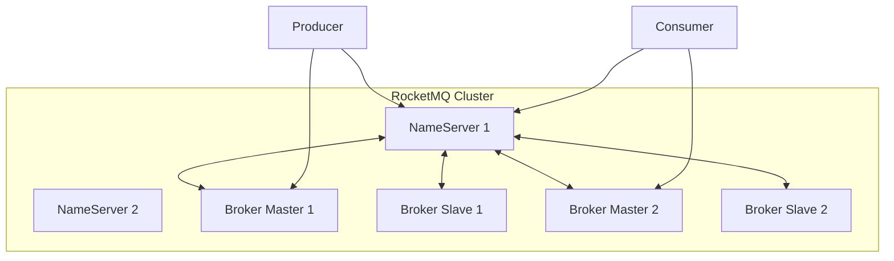
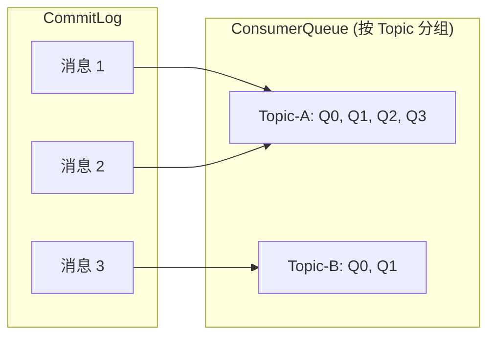

# RocketMQ 架构深度解析

> 上一节 [Kafka Offset 管理](/fw/mq/kafka/offset) 完结了 Kafka 篇的学习，RocketMQ 是另一种思路，从架构开始看起。

## 四大核心组件

| 组件 | 职责 | Kafka 对应 |
|------|------|------------|
| NameServer | 服务发现、元数据管理 | ZooKeeper |
| Broker | 消息存储、发送接收 | Broker |
| Producer | 消息生产者 | Producer |
| Consumer | 消息消费者 | Consumer |



## NameServer：无中心设计

RocketMQ 用 **NameServer 集群** 替代 Kafka 的 ZooKeeper：

| 对比 | ZooKeeper | NameServer |
|------|------------|------------|
| CAP | CP | AP |
| 复杂度 | 高 | 低 |
| 部署 | 需奇数节点 | 无强要求 |

### NameServer 的职责

```java
// NameServer 存储的路由信息
RouteInfo {
    topicRouteData: {
        orderTopicConf: "broker-a:8",
        queueDatas: [
            { brokerName: "broker-a", readQueueNums: 4, writeQueueNums: 4 }
        ],
        brokerAddrs: {
            0: "192.168.1.1:10911"
        }
    }
}
```

Producer/Consumer 通过 NameServer 获取 Broker 地址。

## Broker 架构

Broker 是消息存储和转发的核心：

### 分层存储

```
Broker
├── CommitLog（消息主体）
├── ConsumerQueue（消费队列）
├── IndexFile（索引文件）
└── Config（配置）
```

### 与 Kafka 的核心差异

| 特性 | RocketMQ | Kafka |
|------|----------|-------|
| 存储结构 | 多队列 + 单一 CommitLog | 分区直接对应文件 |
| 顺序写 | 按时间追加 | 按偏移量追加 |
| 索引 | ConsumerQueue + IndexFile | 稀疏索引 |

## 消息存储机制



**优势**：CommitLog 顺序写保证高吞吐，ConsumerQueue 按 Topic 组织便于消费。

## 高可用机制

### 主从同步

```java
// Broker 配置
namesrvAddr=192.168.1.1:9876;192.168.1.2:9876

// Master Broker
brokerRole=SYNC_MASTER
brokerId=0

// Slave Broker
brokerRole=SLAVE
brokerId=1
```

### Dledger 模式（推荐）

RocketMQ 4.5+ 引入 Dledger，实现自动 Leader 选举：

```properties
# Dledger 配置
enableDLegerCommitLog=true
dLegerGroup=broker-a-t
dLegerSelfId=n0
dLegerPeers=n0:192.168.1.1:40911;n1:192.168.1.2:40911;n2:192.168.1.3:40911
```

## 与 Kafka 的对比总结

| 维度 | RocketMQ | Kafka |
|------|----------|-------|
| 吞吐量 | 10万+/s | 10万+/s |
| 延迟 | ms 级 | ms 级 |
| 事务消息 | 原生支持 | 需事务 API |
| 顺序消息 | 支持 | 支持 |
| 运维复杂度 | 中等 | 中等 |

---

*RocketMQ 的事务消息是亮点：[RocketMQ 事务消息](/fw/mq/rocketmq/transaction)*
