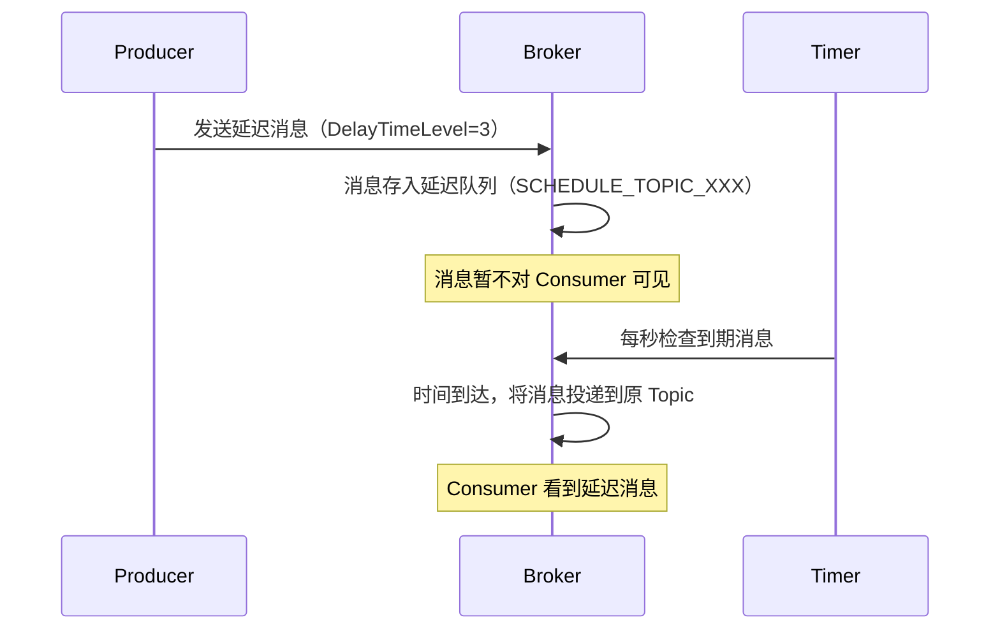

# RocketMQ 延迟消息

> 上一节 [RocketMQ 顺序消息](/fw/mq/rocketmq/ordering) 提到消息消费，延迟消息是 RocketMQ 的特色功能。

## 延迟消息的应用场景

- **订单超时取消**：下单后 30 分钟未支付，自动取消订单
- **短信通知**：预约成功后，指定时间发送提醒
- **重试机制**：处理失败的消息延迟重试
- **定时任务**：定时触发业务逻辑

## RocketMQ 延迟消息的实现

### 延迟级别

RocketMQ 原生支持 18 个延迟级别：

| Level | 延迟时间 |
|-------|----------|
| 1 | 1s |
| 2 | 5s |
| 3 | 10s |
| 4 | 30s |
| 5 | 1min |
| 6 | 2min |
| ... | ... |
| 18 | 2h |

```java
// 发送延迟消息，指定延迟级别
Message msg = new Message("delay-topic", "delay order", body.getBytes());
msg.setDelayTimeLevel(3);  // 延迟 10 秒
producer.send(msg);
```

### 实现原理



**核心**：Broker 内部维护一个 `SCHEDULE_TOPIC_XXX` 的延迟队列。

## 代码示例

### 订单超时取消

```java
@Service
public class OrderService {

    @Autowired
    private RocketMQTemplate mqTemplate;

    public void createOrder(Order order) {
        // 1. 创建订单
        orderMapper.insert(order);

        // 2. 发送延迟消息（30分钟后检查）
        Message<Order> msg = MessageBuilder.withPayload(order)
            .setHeader("orderId", order.getId())
            .build();
        mqTemplate.asyncSend("order:delay:cancel", msg, new SendCallback() {
            @Override
            public void onSuccess(SendResult result) {}

            @Override
            public void onException(Throwable e) {}
        }, 30000, 3);  // 延迟 30s，级别 3
    }
}

@Component
@RocketMQMessageListener(topic = "order:delay:cancel", consumerGroup = "order-cancel-group")
public class OrderCancelConsumer implements RocketMQListener<Order> {

    @Override
    public void onMessage(Order order) {
        Order dbOrder = orderMapper.selectById(order.getId());
        if ("UNPAID".equals(dbOrder.getStatus())) {
            // 超时未支付，取消订单
            orderMapper.updateStatus(order.getId(), "CANCELLED");
        }
    }
}
```

## 与 RabbitMQ 延迟插件对比

| 对比 | RocketMQ 延迟消息 | RabbitMQ 延迟插件 |
|------|-------------------|------------------|
| 实现 | 原生支持 | 需要安装插件 |
| 延迟精度 | 秒级 | 毫秒级 |
| 延迟范围 | 预定义 18 级 | 自定义任意延迟 |
| 性能 | 高 | 中 |
| 消息堆积 | 支持 | 需开启 x-delayed-message |

## 延迟消息的局限

RocketMQ 原生延迟消息的局限：
1. **延迟级别有限**：只有 18 个预设级别
2. **不支持任意延迟**：无法指定"1小时30分后"

### 解决方案：自定义延迟

如果需要任意延迟时间，可以用"定时任务 + 延迟队列"：

```java
// 方案：定时任务轮询 + 延迟检查表
public class DelayMessageScheduler {

    @Scheduled(fixedRate = 1000)
    public void checkAndSend() {
        List<DelayedMessage> messages = delayedMessageMapper.getExpiredMessages();
        for (DelayedMessage msg : messages) {
            mqTemplate.convertAndSend(msg.getTopic(), msg.getContent());
            delayedMessageMapper.markSent(msg.getId());
        }
    }
}
```

## 面试回答框架

**问题**：RocketMQ 延迟消息是如何实现的？

**回答**：
1. 发送时设置 `DelayTimeLevel`，消息进入 Broker 的延迟队列
2. Broker 内部定时检查消息是否到期
3. 到期后将消息投递到原 Topic，对 Consumer 可见
4. Consumer 正常消费即可

---

*除了延迟消息，[RocketMQ 消息过滤](/fw/mq/rocketmq/filter) 提供另一种消息筛选能力*
