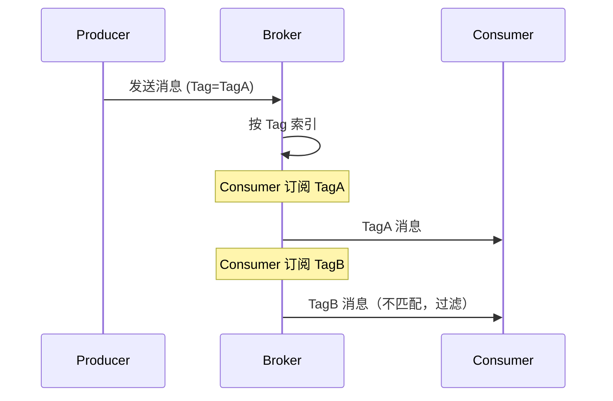

# RocketMQ 消息过滤

> 上一节 [RocketMQ 延迟消息](/fw/mq/rocketmq/delay) 提到消息投递，消息过滤可以在 Broker 端就筛选消息，减少网络传输。

## 两种过滤方式

| 方式 | 说明 | 粒度 | 性能 |
|------|------|------|------|
| Tag 过滤 | 按消息 tag 过滤 | 粗粒度 | 高 |
| SQL92 过滤 | 按消息属性过滤 | 细粒度 | 中 |

## Tag 过滤

### 生产者设置 Tag

```java
// 发送消息时设置 Tag
Message msg = new Message("order-topic", "TagA", body.getBytes());
mqTemplate.send("order-topic:TagB", msg);  // TagB
```

### 消费者按 Tag 订阅

```java
// 订阅单个 Tag
consumer.subscribe("order-topic", "TagA");

// 订阅多个 Tag（用 || 分隔）
consumer.subscribe("order-topic", "TagA || TagB");

// 订阅所有 Tag
consumer.subscribe("order-topic", "*");
```

### Broker 过滤原理



## SQL92 过滤

### 生产者设置属性

```java
Message msg = new Message("user-topic", body.getBytes());
msg.putUserProperty("age", "25");
msg.putUserProperty("type", "VIP");
msg.putUserProperty("city", "Beijing");
producer.send(msg);
```

### 消费者按 SQL 过滤

```java
// SQL92 过滤表达式
consumer.subscribe("user-topic",
    MessageSelector.bySql("age > 18 AND type = 'VIP'"));

while (true) {
    List<Message> msgs = consumer.take();
    // 只有符合条件的消息才会被拉取
}
```

### 支持的语法

| 操作符 | 说明 | 示例 |
|--------|------|------|
| `=` | 等于 | `type = 'VIP'` |
| `<>` | 不等于 | `type <> 'NORMAL'` |
| `>` `>=` `<` `<=` | 比较 | `age > 18` |
| `IS NULL` | 为空 | `city IS NULL` |
| `AND` `OR` | 逻辑 | `age > 18 AND type = 'VIP'` |
| `BETWEEN` | 范围 | `age BETWEEN 18 AND 30` |
| `IN` | 在集合中 | `city IN ('Beijing', 'Shanghai')` |

## Tag vs SQL92

| 维度 | Tag | SQL92 |
|------|-----|-------|
| 过滤位置 | Broker 端 | Broker 端 |
| 条件组合 | 简单（OR） | 复杂（AND/OR/BETWEEN） |
| 数据类型 | 字符串 | 支持数值 |
| 性能 | 更高 | 略低 |
| 适用场景 | 业务类型筛选 | 属性条件筛选 |

## 过滤配置

### Broker 开启 SQL 过滤

```properties
# Broker 配置
enablePropertyFilter = true
```

### 消费者配置

```java
DefaultMQPushConsumer consumer = new DefaultMQPushConsumer("my-consumer");
consumer.subscribe("user-topic",
    MessageSelector.bySql("age > 18"));
```

## 面试回答框架

**问题**：RocketMQ 如何实现消息过滤？

**回答**：
1. Tag 过滤：Broker 按 Tag 建立索引，消费者指定 Tag 订阅
2. SQL92 过滤：消息属性存储在消息体，Broker 执行 SQL 表达式过滤
3. 过滤发生在 Broker 端，减少无效消息传输
4. Tag 过滤性能更高，适合粗粒度筛选；SQL92 适合细粒度条件

---

*了解过滤后，[RocketMQ 消费模式（集群/广播）](/fw/mq/rocketmq/consume-mode) 讲解不同的消费方式*
