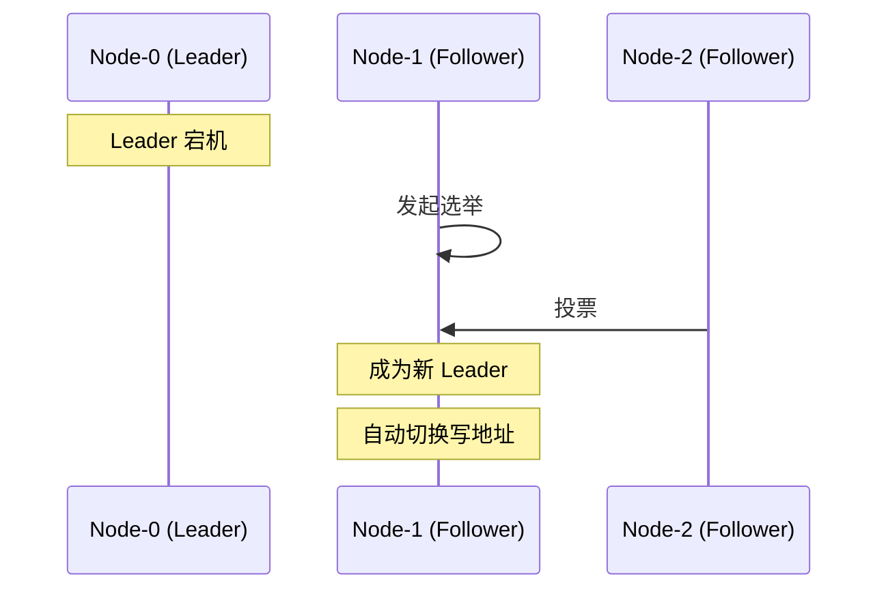

# RocketMQ 高可用机制

> 上一节 [RocketMQ 消费模式（集群/广播）](/fw/mq/rocketmq/consume-mode) 提到消息分发，Consumer 的高可用依赖 Broker 的高可用。

## 高可用架构

RocketMQ 的高可用体现在 Broker 层面：

```mermaid
graph TB
    subgraph "Broker Cluster"
        subgraph "Master-Slave 模式"
            M1[Master Broker]
            S1[Slave Broker]
            M2[Master Broker]
            S2[Slave Broker]
        end

        M1 <-->|同步复制| S1
        M2 <-->|同步复制| S2
    end

    P[Producer] --> M1
    P --> M2

    C1[Consumer] --> M1
    C2[Consumer] --> M2
    C1 -.-> S1
    C2 -.-> S2

    Note over M1,S1: 同步双写
    Note over P: 写 Master
    Note over C1: 读 Master（可配置读 Slave）
```

## 主从同步模式

### 同步复制（SYNC_MASTER）

```properties
# Master 配置
brokerRole=SYNC_MASTER

# Slave 配置
brokerRole=SLAVE
```

**流程**：
1. Producer 发送消息到 Master
2. Master 同步到 Slave
3. 等待 Slave 写入成功
4. 返回 Producer 确认

**优点**：消息不丢失
**缺点**：延迟增加

### 异步复制（ASYNC_MASTER）

```properties
brokerRole=ASYNC_MASTER
```

**流程**：
1. Producer 发送消息到 Master
2. Master 返回确认（不等 Slave）
3. Master 异步同步到 Slave

**优点**：延迟低
**缺点**：可能丢失少量消息

### 仅 Slave（SLAVE）

```properties
brokerRole=SLAVE
brokerId=1
```

Slave 接收来自 Master 的同步。

## Dledger 模式（推荐）

RocketMQ 4.5+ 引入 Dledger，实现自动 Leader 选举：

```mermaid
graph TB
    subgraph "Dledger Group"
        N0[(Node 0)]
        N1[(Node 1)]
        N2[(Node 2)]
    end

    N0 <--> N1
    N1 <--> N2
    N0 <--> N2

    Note over N0,N2: Raft 协议选主
```

### 配置

```properties
# namesrvAddr 配置
namesrvAddr=192.168.1.1:9876;192.168.1.2:9876;192.168.1.3:9876

# Broker Dledger 配置
enableDLegerCommitLog=true
dLegerGroup=broker-a
dLegerSelfId=n0
dLegerPeers=n0:192.168.1.1:40911;n1:192.168.1.2:40911;n2:192.168.1.3:40911
```

### 故障切换

当 Master 宕机：



## 可靠性配置汇总

```properties
# Broker 配置
brokerRole=SYNC_MASTER
flushDiskType=SYNC_FLUSH
```

```java
// Producer 配置
producer.setRetryTimesWhenSendFailed(3);
producer.setSendMsgTimeout(30000);
```

| 场景 | 配置 | 可靠性 |
|------|------|--------|
| 高可靠（金融） | SYNC_MASTER + SYNC_FLUSH | ★★★ |
| 平衡 | SYNC_MASTER + ASYNC_FLUSH | ★★☆ |
| 高吞吐 | ASYNC_MASTER + ASYNC_FLUSH | ★☆☆ |

## 面试回答框架

**问题**：RocketMQ 如何保证高可用？

**回答**：
1. Broker 层面：Master-Slave 架构，消息同步复制
2. 同步复制（SYNC_MASTER）：Master 和 Slave 都写入成功才返回
3. Dledger 模式：基于 Raft 协议，自动选主，无需手动切换
4. Producer 端：配置重试和超时，保证发送成功

---

*RocketMQ 章节完结。接下来进入 [RabbitMQ 架构与 AMQP 协议](/fw/mq/rabbitmq/architecture)*
