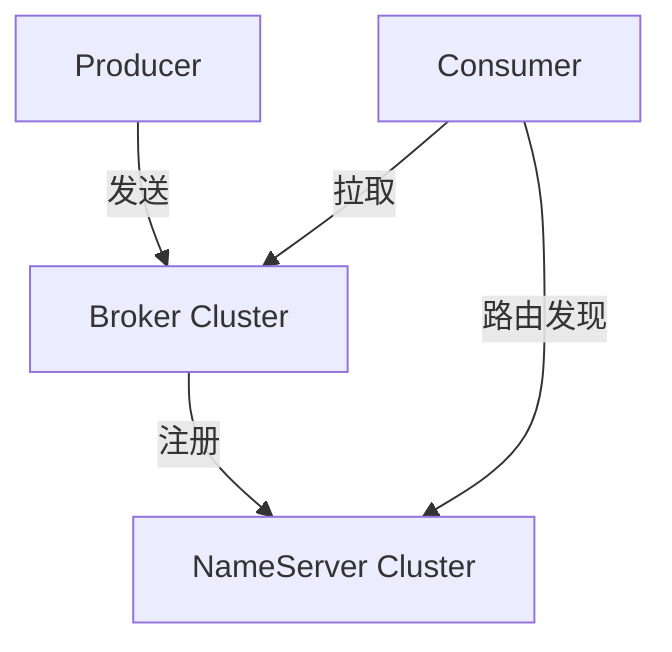

# RocketMQ

> 阿里开源的分布式消息中间件，源于 MetaQ，经历过双十一亿级消息洪峰的洗礼，是国内电商、金融场景的事实标准。

## 核心定位

RocketMQ 在 Kafka 的高吞吐基础上，针对**事务消息**、**严格顺序消息**、**定时/延迟消息**做了深度优化。相比 Kafka，RocketMQ 的 NameServer 比 ZooKeeper 轻量得多，事务消息是开箱即用的，消息过滤支持 Tag 和 SQL92 表达式，更贴合国内业务场景。

## 学习路径

按"架构 → 特色功能 → 消费模式 → 高可用"的顺序展开，前面是后面的依赖：

### 基础架构

| 文章 | 重点 | 何时阅读 |
|------|------|----------|
| [架构深度解析](/fw/mq/rocketmq/architecture) | NameServer / Broker / Producer / Consumer | 第一次接触 RocketMQ |

### 特色消息类型

| 文章 | 重点 | 何时阅读 |
|------|------|----------|
| [事务消息](/fw/mq/rocketmq/transaction) | 半消息、状态回查、本地事务 | 分布式事务场景 |
| [顺序消息](/fw/mq/rocketmq/ordering) | 全局顺序 vs 分区顺序 | 订单状态、库存扣减 |
| [延迟消息](/fw/mq/rocketmq/delay) | 18 个固定级别 + 任意时间 | 超时取消、定时任务 |

### 消费与过滤

| 文章 | 重点 | 何时阅读 |
|------|------|----------|
| [消息过滤](/fw/mq/rocketmq/filter) | Tag、SQL92、Filter Server | 减少无效消息传输 |
| [消费模式](/fw/mq/rocketmq/consume-mode) | 集群消费 vs 广播消费 | 选型决策点 |

### 高可用

| 文章 | 重点 | 何时阅读 |
|------|------|----------|
| [高可用机制](/fw/mq/rocketmq/ha) | 主从同步、Dledger、故障切换 | 生产环境部署必读 |

## 核心特性对照

| 特性 | RocketMQ | Kafka |
|------|----------|-------|
| 事务消息 | 原生支持（半消息） | 0.11+ 支持，配置复杂 |
| 顺序消息 | 全局/分区顺序 | 仅分区顺序 |
| 延迟消息 | 18 个级别 + 任意时间 | 不支持 |
| 消息过滤 | Tag / SQL92 | 不支持 Broker 端过滤 |
| 消息回溯 | 支持按时间回溯 | 不支持 |
| 定时消息 | 支持 | 不支持 |

## 常见疑问

**RocketMQ 适合什么场景？**
电商订单流转（事务消息）、金融支付（严格顺序）、超时关单（延迟消息）、大规模削峰填谷。

**RocketMQ 不适合什么场景？**
超大规模日志采集（Kafka 更优）、极低延迟（μs 级，RabbitMQ 更优）、需要 Exactly-Once 端到端的流处理（Kafka + Flink 更成熟）。

**RocketMQ 的 NameServer 做什么？**
轻量级的服务注册中心，Broker 启动时向所有 NameServer 注册，Producer/Consumer 启动时从 NameServer 拉取路由信息。相比 ZooKeeper 没有选举和数据同步，开销极小。

---

*下一步深入 [RabbitMQ](/fw/mq/rabbitmq) 了解 AMQP 协议与复杂路由场景的实现*