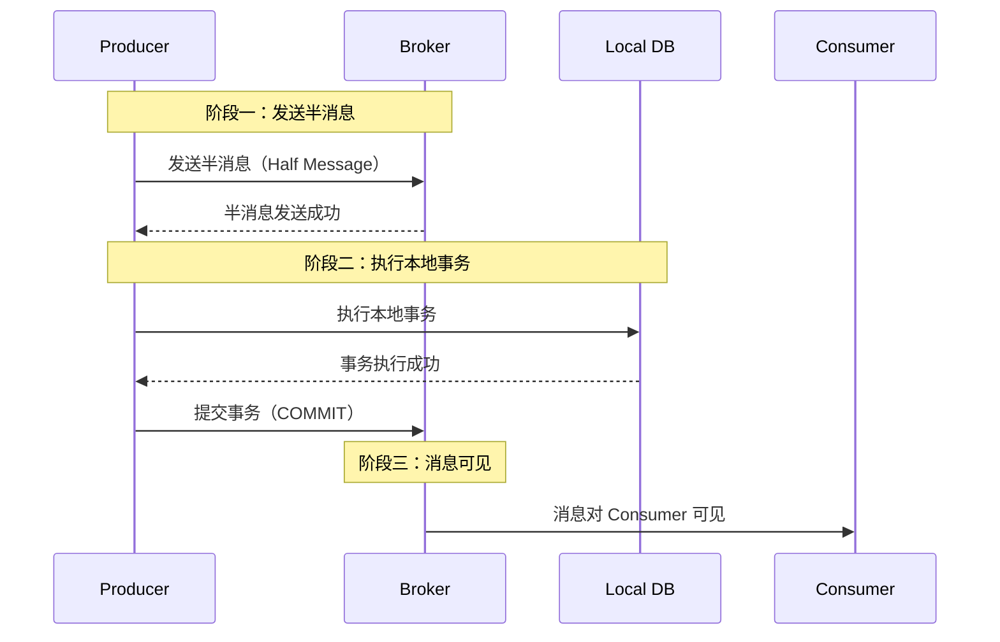
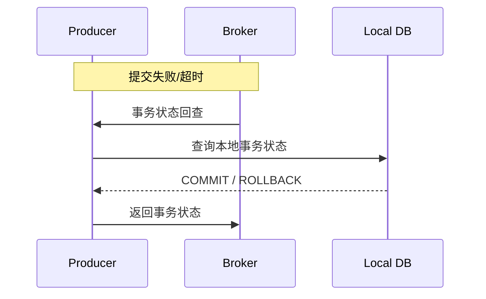
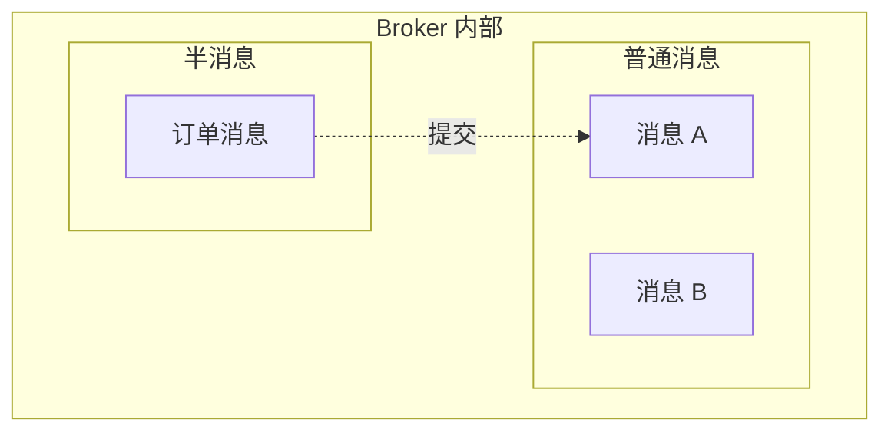

# RocketMQ 事务消息

> 上一节 [RocketMQ 架构深度解析](/fw/mq/rocketmq/architecture) 提到 RocketMQ 原生支持事务消息，这是它对比 Kafka 的核心优势。

## 为什么需要事务消息

传统本地事务 + MQ 的问题：

```java
@Transactional
public void createOrder(Order order) {
    // 1. 本地事务
    orderMapper.insert(order);

    // 2. 发送消息（如果发送失败，本地事务回滚了，但这里不会执行）
    mqProducer.send(order);
}
```

RocketMQ 事务消息解决的是：**本地事务和消息发送的一致性**。

## 事务消息原理

### 两阶段提交



### 事务状态回查



## 代码实现

### 定义 TransactionListener

```java
public class OrderTransactionListener implements TransactionListener {

    @Override
    public LocalTransactionState executeLocalTransaction(Message msg, Object arg) {
        // 1. 执行本地事务
        String orderId = (String) arg;
        try {
            orderService.createOrder(orderId);
            return LocalTransactionState.COMMIT_MESSAGE;
        } catch (Exception e) {
            return LocalTransactionState.ROLLBACK_MESSAGE;
        }
    }

    @Override
    public LocalTransactionState checkLocalTransaction(MessageExt msg) {
        // 2. 事务状态回查
        String orderId = msg.getKeys();
        Order order = orderService.getOrder(orderId);

        if (order != null && "PAID".equals(order.getStatus())) {
            return LocalTransactionState.COMMIT_MESSAGE;
        } else if (order != null && "CANCELLED".equals(order.getStatus())) {
            return LocalTransactionState.ROLLBACK_MESSAGE;
        }
        return LocalTransactionState.UNKNOWN;
    }
}
```

### 发送事务消息

```java
TransactionMQProducer producer = new TransactionMQProducer("order-producer-group");
producer.setTransactionListener(new OrderTransactionListener());
producer.start();

// 发送事务消息
Message msg = new Message("order-topic", orderId, order.toJSON());
SendResult result = producer.sendMessageInTransaction(msg, orderId);
```

## 半消息机制

半消息（Half Message）是事务消息的核心：



**半消息特点**：
- 对 Consumer 不可见
- 存储在特殊队列中
- 事务提交后才可见

## 与普通消息的区别

| 对比 | 普通消息 | 事务消息 |
|------|----------|----------|
| 发送 | `send()` | `sendMessageInTransaction()` |
| Consumer | 立即可见 | 事务提交后才可见 |
| 失败处理 | 重试 | 状态回查 |
| 性能 | 稍高 | 略低（两阶段） |

## 应用场景

- 订单创建 + 库存扣减
- 支付成功 + 积分发放
- 用户注册 + 欢迎短信

## 面试回答框架

**问题**：RocketMQ 事务消息是如何实现的？

**回答**：
1. 事务消息分两阶段：发送半消息 → 执行本地事务 → 提交/回滚
2. 半消息对 Consumer 不可见，只有提交后才可见
3. 如果提交失败或超时，Broker 会回查 Producer 的本地事务状态
4. Producer 需要实现 `TransactionListener`，提供执行和回查两个方法
5. 适用场景：需要保证本地操作和消息发送一致性的业务

---

*RocketMQ 还支持顺序消息：[RocketMQ 顺序消息](/fw/mq/rocketmq/ordering)*
